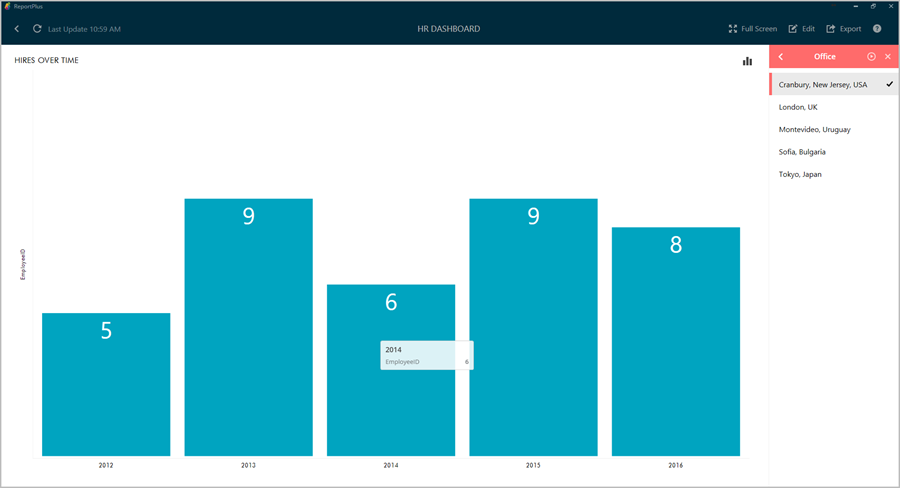

////
|metadata|
{
    "fileName": "getting-started",
    "controlName": [],
    "tags": ["dashboard","sharing","widget","editing"]
}
|metadata|
////

= Getting Started

ReportPlus is a self-service, cross-platform business intelligence tool that puts the power in your hands to do dashboard reporting - all without the need for custom programming. With ReportPlus you can quickly create and edit dashboards, easily query and filter enterprise data sources, build meaningful visualization over data and effortlessly share your work with others whether or not they are existing ReportPlus users.

== Dashboard Selector

When you first open ReportPlus, you are greeted by a _dashboard selector_ which gives you the ability to:

* **Open saved dashboards**. These are the ones displayed as thumbnails in the initial view, and you open them by _clicking on the corresponding thumbnail image_.
* **Open shared dashboards and folders**. Shared dashboards () and Shared folders () are also displayed as thumbnails in the initial view.
* **Create a new dashboard**. By clicking the _NEW DASHBOARD_ button in the top left corner of the initial view, you can start to create your own dashboard.
* **Access General Settings** by _clicking the Settings button with the gear icon_ in the bottom left corner of the initial view you access the general settings dialog, which among other things allows you to: manage your credentials, log in to your cloud storage account, manage your subscription, access the Help section and contact the Help Desk. 
* **Access your Recent and Favorite dashboards** by clicking the _Recent_ and _Favorites_ buttons in the left pane of the initial view. The _Recent_ section allows a quick access to your recently opened dashboards, while _Favorites_ lets you edit, tag, rename, share or delete your favorite dashboards.
* *Access Advanced dashboard actions* by clicking on the overflow button () for the desired dashboard. These include adding dashboards to Favorites, adding Tags, and Sharing, Renaming or Deleting dashboards.

== Opening & Navigating Dashboards

You can open existing dashboards by clicking on the dashboard thumbnail
image in the initial view.

A dashboard is composed by a tile of visual blocks called widgets. Each
widget is meant to display a different piece of related information,
allowing you to communicate insights at a glance. This dashboard-widget
structure allows you to better digest the bigger picture in your
business.

It’s possible to *maximize* any of the dashboard widgets just by clicking them.

The maximized view not only allows a larger display of the information,
but can also enable some interactions. For instance, the grid view
supports horizontal and vertical scrolling, and the chart view supports
zooming and panning. Also drill down & drill up actions become possible if
the underlying data model supports it.

You can also switch views and look at the data behind your chart if you click on *#View Table* in the top right corner.

It is possible to *filter information* at a widget or a dashboard level. 

* _Widget filters_ (a.k.a. link::data-filters#QuickFilters[QuickFilters]) are displayed in a collapsible side panel under _Widget Filters_ once a widget is maximized.

* _Dashboard filters_, on the other hand, are displayed in a collapsible panel on the right-hand side.

For more information on Dashboard Filters, check out link:dashboard-filters-and-binding[this section].

=== View & Edit Modes

When first opening a dashboard, you will be browsing it in _View Mode_. This mode allows you to navigate and filter the information displayed in it, but you won't be able to change the dashboard definition. In order to apply changes to a dashboard, you must switch to the _edit mode_. You can do this by clicking on the "Edit" button in the top right corner of the screen. This enables editing options such as adding, removing, resizing and styling widgets.

To exit the edit mode, you must click the _Done_ button in the top left corner. This switches back to the _View Mode_, which optimizes navigating the contents of a dashboard by removing unnecessary visual clutter.

Dashboards imported from iOS with passcode locks enabled will be shown in a read-only mode; you will need to enter the required code to switch to edit mode.

=== Dashboard Preview

While in Edit Mode, you will be able to *Preview* your dashboard by clicking the _Preview_ the button in the top right corner.

This is a view-only preview which allows you to:

* View the dashboard as a whole.
* Zoom into any individual widget.
* Apply any of the configured Dashboard or Widget Filters.