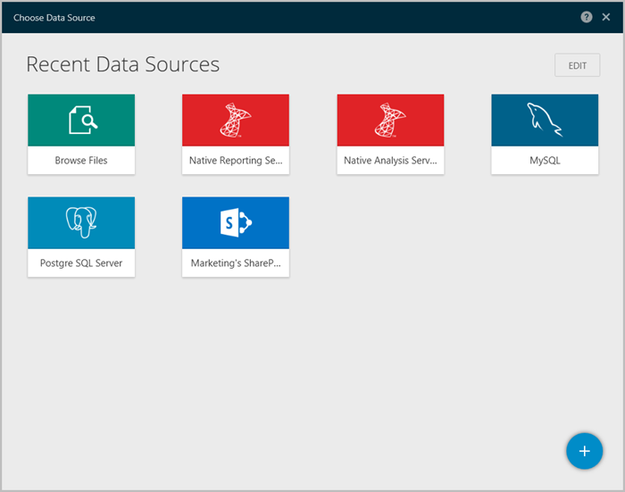
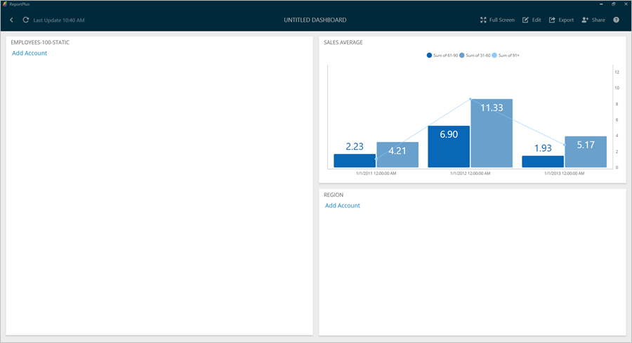
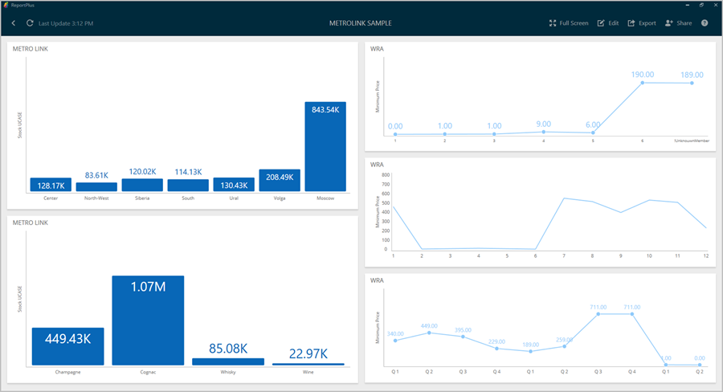

////
|metadata|
{
    "fileName": "dashboard-creating-process",
    "controlName": [],
    "tags": ["dashboard","sharing","widget","editing"]
}
|metadata|
////

= Dashboard Creation Process

ReportPlus is a unique tool since it allows you to connect to data sources and author new dashboards from scratch with ReportPlus iOS and ReportPlus Desktop, without previous server side configurations.

== Creating a New Dashboard

In order to start the dashboard authoring process, you must first click on the _New Dashboard_ button on the top left corner of the initial dashboard selector
view of ReportPlus Desktop.

=== Creating a Dashboard from scratch

When the _New Dashboard_ button is clicked, the following dashboard canvas is displayed:

A new window will pop up displaying the defined data sources. You can configure a new data source by clicking on the corresponding button in the _New Data Source_ section. This window can be opened again by clicking on the blue + button on the bottom right corner. 

If working in Edit Mode, you will see the *Undo* and *Redo* buttons on the top left corner, and the *Preview*, *Themes*, *Merge*, *Help* and *Additional Actions* buttons on the top right corner. 

A panel to the right, which corresponds to the Dashboard Filters, can be expanded by clicking on the funnel icon. For more information on Dashboard Filters, check link:http://help.infragistics.com/reportplus/dashboard-filters-and-binding[this section].

== Managing Data Source Connections

In order to enable the creation of dashboards, ReportPlus provides the capacity to connect to a number of enterprise data sources to retrieve the information from. The ReportPlus application connects directly to the link:http://help.infragistics.com/reportplus/how-to-configure-data-sources[supported data sources], meaning it does not require any changes to be made on the server side. For a user to be able to create a connection to a data source, they need to have a set of credentials with permissions to read the data. ReportPlus supports more than 20 data source types, namely Content Managers, CRMs, Datastores, Social Networks, Web Analytics and others. Users can also join multiple data sources to create a *Composite* data source. For more information on creating one, check out the link:http://help.infragistics.com/reportplus/multiple-data-sources[Multiple Data Sources] section.

Creating dashboards based on link:http://help.infragistics.com/reportplus/how-to-configure-data-sources#ExcelCSVGoogleSheets[Excel spreadsheets or CSV files] is a common scenario. It's possible to do this in three ways: pulling it from a local repository, pulling it from a content repository in the cloud or pulling it from a public URL configured as a web resource.

=== Creating a new Data Source Connection

The _New Dashboard_ button on the top left pane prompts the new data source wizard dialog. This dialog is meant to guide you in the process of configuring a new connection to a data source.

The first input you need to provide is what type of data source you wish to configure. For instance, suppose you'd like to create a connection to a link:http://help.staging.infragistics.local/reportplus/how-to-configure-data-sources#SharePointServer[_SharePoint_ site]. In order to do this, you would have to navigate to the _Content Managers_ section, then click _SharePoint_. Once you do this, you are expected to enter information such as the URL of the SharePoint site, and authentication credentials such as user, domain, and password information. 

The specific fields required to configure a connection vary between the different data sources. Once you have entered all the required information you must click on _Connect_. This will trigger a _verification_ window, which attempts to establish a connection with the data source, and confirms whether it succeded or not. If it succeeded, you will be taken to a _Browse for a Data Source_ panel, where you can navigate the contents of this new data source by selecting it or clicking the "Select" button.

In the case of link:http://help.infragistics.com/reportplus/how-to-configure-data-sources#SharePointServer[SharePoint] connections you can navigate the hierarchy of sites, subsites, and lists. In the dashboard creation process you can use files, such as Excel spreadsheets hosted in document libraries. 

Another example would be to configure a connection to a link:http://help.infragistics.com/reportplus/how-to-configure-data-sources#MicrosoftSQLServer[SQL Server] database. In this case you would have to navigate to the New Data Source section, then click SQL Server.

image::images/ConfiguringDataSources/EnterSQLServerdetails_desktop.png[EnterSQLServerdetails_desktop]

Once you save the connection, you will be able to navigate to the list of all databases in a SQL Server instance, and within a database see all tables, and views.

image::images/DashboardCreationProcess/NewSQLConnectionDatabases_Desktop.png[NewSQLConnectionDatabases_Desktop]

Once you select a data source, you can easily add a new data set to the dashboard. Just click the information you want to use, and it will be added automatically into the canvas.

=== Changing Data Sources for a Dashboard

After a dashboard is created, it is still possible to change the widget's linked data sources. To do so, access the _Dashboard Settings_ menu by clicking the *overflow icon* in the top right corner and select _Change Data Sources_.

Clicking on the Edit icon for the data set you wish to change will take you to the _Change Data Sources_, where you will be able to select the updated data source.

For each of the fields in the old data source, select a corresponding one in the new one.

=== Importing Dashboards with new Data Sources

ReportPlus' cross-platform compatibility means that you can also import dashboards from different platforms into Desktop. The data sources linked to the dashboard do not need to be added to Desktop before the dashboard is imported; they can be added during the import through the Data Source Import Wizard.

For example, let's import a pre-existing dashboard from iOS. After opening the dashboard in ReportPlus, you will face one of three scenarios:

1. *You will need to enter the account details for your data sources if they hadn't already been added*. In the case below, only one of the three data sources had been loaded in Desktop before the dashboard was imported.

Clicking on the *Add Account* button will take you to the _Connection Details_ data source window, where you will be able to review the data source details first. Clicking the *Next* button will take you to the next screen, where you can create a new account or enter an existing one for the data source.

[start=2]
2. *In some cases, the imported data source cannot be automatically mapped to an existing one.* This applies, for example, to working with a ReportPlus iOS dashboard with Google Drive. If you already have one or more existing Google Drive data sources in Desktop, you will be prompted to associate the data source you import with one of the existing ones.

In such a case, you will see the following dialog:

Clicking on the *Not Mapped* button will take you to another screen where you can choose which of the existing data sources you'd like to map the data to.

image::images/DashboardCreationProcess/ImportingDashboard_MappingAccount2.png[ImportingDashboard_MappingAccount2]

If none of the existing data sources match the one you import, then you can skip the mapping by going back and clicking *Done*. You will then be prompted to create a new account for the data source by clicking on the *Add Account* button pictured in step 1.

[start=3]
3. *You will not need to add any account information or map accounts if you had already created the data sources required by the dashboard*. 

In this case, you will simply see the complete dashboard displayed.

== Managing Widgets

=== Widget Editor

Once a data set is selected, the widget editor is automatically displayed. This view helps you work with the data to get the most desired view; you can also select the most suitable visualization for it, making it as easily to digest as possible. In this screen, you can:

* **Hide data columns**.
* **Sort & filter data**.
* **Aggregate data in the pivot table**.
* **Chart & format data visually**.
* **Bind the widget data to a dashboard page selection**.

There are three main panes in the Widget Editor:

* *The left pane*, where you will find the list of available fields in the selected data set.
* *The center pane*, which has two sub-sections:
- The *upper* section, where you can preview the final result.
- The *lower* section, where you will find the Pivot Table editor. This tool is meant to help you slice-and-dice data according to your needs.
* *The right pane*, which has six sub-sections:
- link:http://help.infragistics.com/reportplus/data-visualizations[*Visualizations*], where you can choose your desired visualization.
- *Visualization Settings*, where you can configure the settings for the visualization you have selected.
- link:http://help.infragistics.com/reportplus/dashboard-filters-and-binding[*Dashboard Filter Connections*], which allows you to centrally configure the binding between a dashboard filter and your widget.
- link:http://help.infragistics.com/reportplus/navigation-between-dashboards[*Link to Dashboard/URL*], where you can add links to a different dashboard or a URL.
- link:http://help.infragistics.com/reportplus/dashboard-filters-and-binding#ParameterBinding[*Parameters*], which bind a dashboard filter to a particular parameter of the widget dataset.
- link:http://help.infragistics.com/reportplus/configuration-settings#WidgetGeneralSettings[*General*], from where you can change the general settings for your widget.

For detailed information regarding the Widget Editor, check the link:http://help.infragistics.com/reportplus/data-filters#_widget_editor[Data Filters] section.

After you're done building the widget and selecting the appropriate visualizations, click on the _Done_ button on the top left corner to return to the dashboard editor. In the Dashboard editor, you can control the layout, size and location of widgets by simply dragging widgets and their borders.

=== Reusing Widgets

Speed up the creation of dashboards by reusing widgets; you just need to **copy & paste** any widget you want.

You can copy & paste any widget within a dashboard or even across dashboards. Note that you can create new dashboards by mashing up widgets from other dashboards.

== Saving, Sharing & Exporting

At some point in the dashboard creation process you will want to save your progress. You should know that dashboards are *automatically saved locally every 20 seconds*. If for some reason the application is terminated, the next time you open ReportPlus you should see a screen such as the following, allowing you to recover the dashboard you were working on before.

You will then be taken to the Dashboard Editor, where you can can choose to explicitly save your dashboard. 

Add *tags* to your dashboards to easily find them when you search by clicking the overflow menu for your dashboard.

You will also be able to choose from any of the suggested tags available in each dashboard's *Tag Menu*.

=== Sharing Insights

Shared files are ideal for cross-team collaboration; once you share a folder and add other people to it, the new files will appear in their accounts as well. Sharing a dashboard means users will get a local copy of your dashboard; they will not be able to edit your local copy.

The *Share dialog* can be accessed by clicking on the _Action Menu_ button present both in folders and dashboards.

Enter the e-mail addresses of the people you want to invite, add a personal message, and set the level of access those people will have over the shared dashboard. The available options are:

* *Can view* - the user has read-only access to the dashboard.
* *Can share* - the user has read-only access to the dashboard, but they can also share it with other people.
* *Can edit* - the user can view, share and edit the dashboard.

After setting the access level, click _Share_. 

* *You can change the access level for users at any time* by accessing the _Share_ menu. You will see a message saying _Currently sharing_. If you access the menu, you can change the access level by selecting an option from the dropdown.
* *You can also unshare any dashboard or folder at any time* by accessing the _Currently sharing_ menu and removing the user.

=== Exporting Insights

You can also easily export your dashboards by using the available Export options:

image::images/DashboardCreationProcess/DashboardActionsExport_Desktop.png[DashboardActionsExport_Desktop]

* *Export a Power Point*. Save, Email or Open a Power Point file with your widgets. You can add a description for each widget if necessary.
* *Export a PDF*. Save, Email or Open a PDF file with your widgets. You can add a description for each widget if necessary.
* *Export a Screenshot*. Email a screen capture of the dashboard.
* *Export File*. Export the dashboard locally.

In addition, you can change the Export Settings, including the Author Name, Company Name, Color and Logo and the Table Settings. For details on how to configure exported dashboards, check out the link:http://help.infragistics.com/reportplus/export-options[Export Options] section.