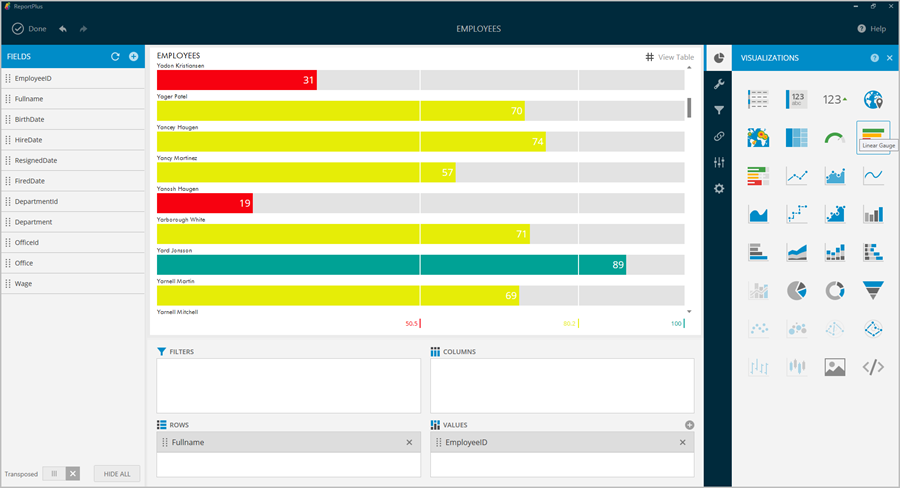
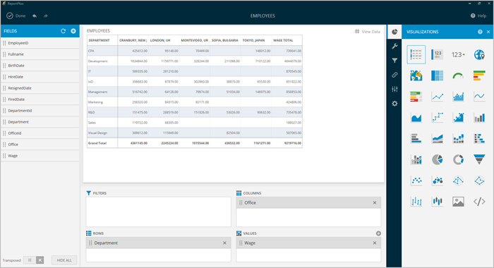
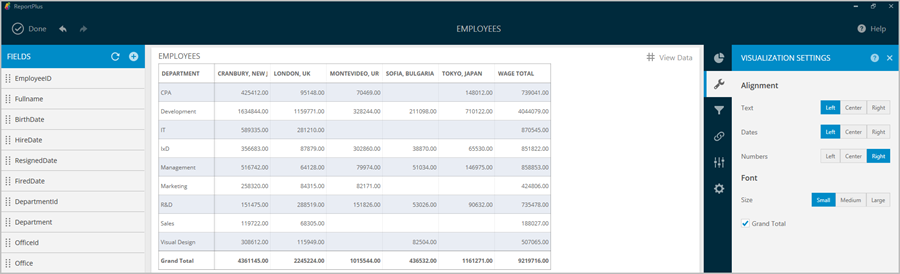
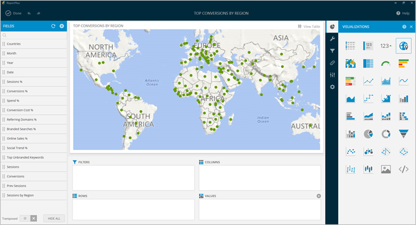
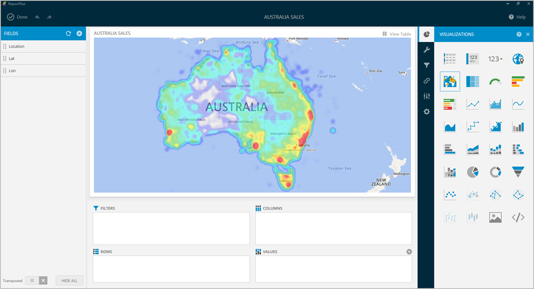
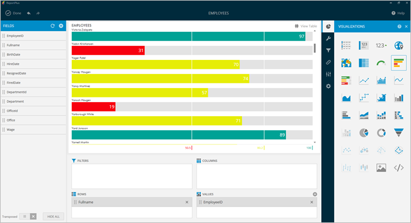
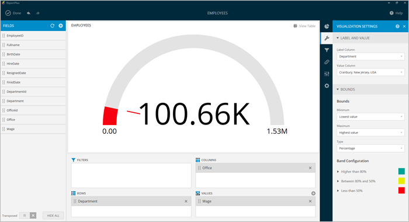

////
|metadata|
{
    "fileName": "data-visualizations",
    "controlName": [],
    "tags": ["visualizations","text view","conditional formatting","gauge"]
}
|metadata|
////

= Data Visualizations

In order for users to get the most insight possible out of business data, ReportPlus Desktop provides several options to customize the way information is visualized. This article describes different data visualization & styling options available when presenting data and building your dashboard.

There are eight visualization types:

* link:#GridView[Grid View]
* link:#TextView[Text View]
* link:#MapView[Map View]
* link:#HeatMapView[Heat Map View]
* link:#TreeMapView[Tree Map View]
* link:#WebView[Web View]
* link:#GaugeViews[Gauge Views], including the link:#LinearGauge[Linear], link:#CircularGauge[Circular], link:#TextGauge[Text], and link:#BulletGraphGauge[Bullet Graph] gauges.
* link:#ChartsVisualizations[Charts], including both single-series and multiple-series charts.

You can configure link:#BoundsConfiguration[Bounds] or link:#ConditionalFormatting[Conditional Formatting] for all visualization types.

Once a data set is added to the Dashboard Editor, the Widget Editor is displayed with the visualization options menu presented in right-hand panel. The default section is for Visualizations, and contains a set of icons for the different visualization types. The remaining sections display the configuration options for the currently selected visualization type, while the visualization preview is displayed in the central section of the screen.

image::images/DataFilters/PivotEditorView_Desktop.png[PivotEditorView_Desktop]

It is possible to display the visualization name by hovering over visualization thumbnails.

If a visualization option is not suitable for your data, you will see a faded visualization icon.

[#GridView]
== Grid View

The grid view is the default visualization option for displaying data which presents the information in a matrix. You can resize the width of a column in the grid just by clicking on the grid header, which will highlight the column in the grid, and then dragging the resize handle in the column header. Slide it left or right to modify the column’s width.

You can adjust the size of your font by going to *Visualization Settings* and choosing a different size; the default size is _Small_. The _Medium_ size will increase the size by 2px, whereas _Large_ will increase by 4px.

You can also set the first column to be in a fixed position by checking the "Fix the first column" option under Visualization Settings. This is particularly useful when working with many columns.

**Note**: _The grid view is suitable in a dashboard when the number of
rows, and columns is less than 10. When you’re dealing with small
amounts of data, the preferred approach may be to "just show the
numbers"_.

[#adhochierarchies]
=== Ad-Hoc Hierarchies

ReportPlus automatically creates a hierarchy for date fields with a Year-Month-Date structure. The ad-hoc hierarchy feature allows you to hierarchically analyze the data, allowing ReportPlus to create a new hierarchy with the fields located in the *Rows* area of the pivot table.

This feature applies to plain data sources (for example, SQL tables, Excel spreadsheets or CSV files) and not to multidimensional data sources like Analysis Services. For those cases, hierarchies are defined on the server side, and ReportPlus supports the expand and drill operations.

To enable ad-hoc hierarchies, just drag two or more fields into the *Rows* placeholder of the pivot table. Once you have done so, you will see a _Hierarchy_ option appear next to the Rows placeholder in the pivot table. It will be disabled by default; toggle it in order to enable the hierarchies. 

[#ConditionalFormatting]
==== Conditional Formatting

The grid view, among other views, allows you to provide different formatting of the cell depending on the values found in a numeric column. For instance, values in the lower 50% range of a grid, can be colored with a red adorner to signal a problem. 

=== Enabling Conditional Formatting

To enable conditional formatting on a numeric column, click on the column item on the fields list to prompt the column settings dialog. If the grid view is selected, *and the column data type is numeric*, the conditional formatting configuration is shown under the _Formatting_ section but disabled by default.

The conditional formatting configuration allows you to establish styling rules per ranges of data up to three ranges (typically used for styling, upper, middle, and lower ranges). Depending on the nature of the information, low values might be a good or bad signal, so you have the flexibility to configure the styling in the way that makes the most sense in your situation. 

Styling options in conditional formatting include the use of marker icons available from a pre-configured set (which ships with ReportPlus) to indicate the range in which the value of the grid cell falls into. You can also specify the fill color of the marker icons by navigating to the _Band Configuration_ section and specifying a color.

[#TextView]
== Text View

The Text View displays information that follows a _key-value_ pattern, such as a contact’s card information (e.g. Name: John). It does so by displaying only the first row of data paired with the column’s label. In order to display a specific row it’s possible to apply filters to make sure that’s the only row displayed, so it’s the one picked up by the Text View.

The **Text View supports conditional formatting**, as explained in the previous section (the ability to style with different colors, and icons). The text view is suitable when you want to allow the viewer to easily digest the attributes of a single entity. Examples include product specifications, or a person’s contact information, etc.

[#MapView]
== Map View

To display information graphically on a map you can select the Map visualization option, which attempts to bind each row in the data set with a location to the world map.

The map type displayed can either be the standard political map, a satellite picture, or a hybrid between the two. This can be configured through the Map Type setting.

[#GeoLocation]
=== Geo Location

In ReportPlus, the intelligence of where to plot points in the map, based on the data set values, is based on one of two methods: either geocoding or geo-coordinates (e.g., latitude and longitude). 

*Geocoding* assumes that the text value describing the location comes in one of the datasets columns, and will be translated into a geographical location. This location feature works well for country, state, and town names, but for more ambiguous locations it might not generate the expected result.

On the other hand, *geo-coordinates* assume that latitude and longitude information comes as part of the data set, and is present in some columns. Accepted formats by ReportPlus are two:

[circle]
* Only one column containing both latitude and longitude information separated by a comma.
* Two different columns that must be mapped to latitude and longitude respectively.

By default, the map is configured to attempt geocoding-based localization based on the values of the first column of type text. To change the default configuration, you must change the _Geolocation Type_ setting in the Map configuration dialog in order to switch between geocoding and geo-coordinates. 

To change the column that contains the expected location information, you must change the selection associated to _Geocoding Column_. 

=== Formatting

By default, the map view plots, when possible, each row of the data set with a circle marker in the map. Whenever the user hovers over any of those pins, the text contained in the column selected as _Label_ in the configuration is displayed in the tooltip. The color of the marker is green by default when the Map Type is Standard, and red when it is Satellite or Hybrid.

There are occasions when it's desired to do more than just display a pin in a map. Sometimes the user may need to display a magnitude for each point or a state. For these cases, ReportPlus allows you to associate a numeric value column to the point that was located using the methods described in the previous version. This allows two additional formatting capabilities in the map view. The first one is to display colored circles sized by the magnitude of the value. You can choose a pre-defined color (Green, Red and Yellow) by selecting it in the _Value Color_ configuration in the map settings.

The second formatting option is to enable *conditional formatting on the map view* and allow different icon markers to appear differently on the map. This is achieved in the conditional formatting configuration, of the numeric column selected as _Value_ in the map's _Visualization Settings_.

A text label is displayed in the popup only if the Value settings is empty. Otherwise, the value from the Label column followed by the value from the Value Column is displayed in a tooltip available upon hovering. 

[#HeatMapView]
== Heat Map View

The Heat Map view displays information graphically on a map with colors. As with the Map View, each row in the data set will be bound to a location in the world map. The Heat Map, however, will identify high-density areas as 'hot' and low-density areas as 'cold', so you will be able to quickly identify areas with high data intensity.

As with the Map View, the map type displayed can either be the standard political map, a satellite picture or a hybrid between the two. The Heat Map settings has additional settings to configure, including Layers and link:#GeoLocation[Geo Location]. *Geocoding is not supported in the Heat Map visualization*.

=== Heat Map Layers

You can add an additional layer to your Heat Map visualization by tapping the *Pins and HeatMap* option under _Layers_. The pins will show the exact location of your data while retaining the visual representation of the heat map.

=== Assigning Weight to a Heat Map variable

The Heat Map offers a simple yet effective way to display information in relation to the point of distribution through color intensity. However, you might want to display some information more prominently in the map, which is when the Weight you assign to a variable comes into play. Regular Heat Maps only consider the point of distribution to determine the color intensity, but if you use the Weight variable, the Heat Map will use it to determine how much intensity one pin contributes.

[#TreeMapView]
== Tree Map View

The Tree Map visualization displays information hierarchically using tiles of different sizes across your widget. The visualization aims to help you discover patterns, with the proportion of each rectangle representing a different metric.

The size of each tile will be determined by the field selected in the _Value Column_ of the Tree Map Settings.

Tree Maps are useful to display large quantities of data and, in addition, the visualization displays your data according to the screen size available. When maximizing or viewing the widget in preview mode, shapes change to adapt to the new screen size.

=== Tree Map Layouts

There are three different layouts to choose from when using the Tree Map:

* *Squarified*: this is the default layout for the Tree Map. All data is represented in tiles, which makes it easier to identify patterns and relations between similar data.
* *Slice and Dice*: the direction is changed to a horizontal-only layout, where the sizes of each "slice" is sized according to the field selected in the _Value Column_. This is useful with small amounts of data.
* *Strip*: the strip layout is a hybrid between the Squarified and the Slice-and-Dice layouts. The direction is changed to a horizontal layout, but with the tiles used in the squarified layout.

To change layouts, go to *Visualization Settings*, access the _Layout_ dropdown, and select the layout you need.

=== Show Details

In addition to the layout, you can also manage the level of detail you want your Tree Map to have. If you add one or more columns under _Columns_, you will be able to click *"Show Details"*. This will break down the tiles defined by each row based on the field dropped into the Columns section. 

Let's look at the following example. The "State" field has been dropped in Rows, and the "Cities" field in Columns. If the "Show Details" checkbox is clicked, a parent tile with the states will appear, and it will be broken down based on the cities that are part of that particular state as defined in the Data Source.

[#WebView]
== Web View

The Web View displays information in an embedded browser by making a request to a URL and displaying the results. It works *only with the first row in the data set*, and, _if the URL field in the visualization's Image Settings contains a valid URL_, its content will be retrieved and *the page will be displayed*.

image::images/DataVisualizations/PivotEditorViewWebView_desktop.png[PivotEditorViewWebView_desktop]

[#GaugeViews]
== Gauge View

The Gauge View displays a single value, or a list of values, comparing them with range thresholds. The gauge also allows for conditional formatting of the different ranges. To select gauge view, click on the gauge-shaped icon on the Visualization options menu.

ReportPlus Desktop gauge support comes in four different flavors: Linear, Circular, Text and Bullet Graph gauge. You can switch between gauge types by changing the visualization.

[#LinearGauge]
=== Linear Gauge

Linear Gauge displays a label, the value of which is taken from the _Label Column_ configuration, and a value that comes from the configured _Value Column_. The value is charted as a rectangle and is also displayed in a numeric format within its bounds or next to it.

This gauge type is suitable to compare the values of different rows side by side.

[#CircularGauge]
=== Circular Gauge

The Circular Gauge displays the band's minimum and maximum thresholds, and the current value. It also paints the background with the color of the current range.

[#TextGauge]
=== Text Gauge

The text gauge displays the Value column data in a large font. This flavor is suitable for very high priority metrics. By default, the gauge will visualize the data from the Value column for the first data row unless any filters are applied so that the chosen data row is different.

[#BulletGraphGauge]
=== Bullet Graph Gauge

The Bullet Graph Gauge is very similar to a Linear gauge; it displays a label from the _Label Column_ and a value from the _Value Column_. The value is charted as a horizontal line, and it is also displayed on the right in a numeric format.

The Bullet Graph adds a new visual indicator to the Linear gauge, a vertical mark that is based on a target value from the _Target column_. This new indicator is retrieved from a numeric column, meaning that you need two numeric columns and a text column to configure this view. 

This gauge is useful for comparing values side by side, while also evaluating the performance from the value (horizontal line) against the target value (vertical mark).

[#BoundsConfiguration]
=== Bounds configuration

Each gauge type has a common band range configuration, which is similar to the one used in conditional formatting. The configuration dialog requires:

* **Minimum and maximum values**. These values are automatically set as the lowest and highest value in the data set for the specified value column, but can also be overriden manually with constant values.
* **Bands configuration**.This section requires you to establish two thresholds to split the range in three spaces. The thresholds can be defined as a percentage, or as a constant value. Additionally, the definition of the color to associate to each band is configured here. By default the upper band is colored red, the middle yellow, and the lower green.

[#ChartsVisualizations]
== Charting Data

You can select any of the chart icons displayed in the Visualizations options menu as long as it is suitable for your data. ReportPlus will select the first numeric columns in the dataset and attempts to match the selected chart type data series requirements. For instance, in a Column Chart all numeric columns are added to the chart, and for a OHLC chart, different columns with the Open, High, Low and Close series are expected. The automatic selection of columns done by ReportPlus can be modified in the _Chart Settings_ configuration.

There are a number of available chart types:

Single series chart types:

* Column Chart
* Bar Chart
* Line Chart
* Spline with Area Chart
* Pie Chart
* Area Chart
* Spline Chart
* Doughnut Chart
* Circular Chart
* Funnel Chart
* Step Line Chart
* Step Area Chart

Two or more series required chart types:

* 2 Y-Axis Chart
* Scatter Chart
* Bubble Chart
* Polar Chart
* Stacked Column Chart
* Stacked Bar Chart
* Stacked Area Chart
* OHLC Chart
* Candlestick Chart

Configuration settings for chart types are described in the following sections.

=== Chart Trendlines

Chart settings enable the display of trend lines, which are lines that are painted across a chart, based on an algorithm. Trendlines are a very simple, yet powerful tool to help you determine trends in data sets, and define thresholds for taking action. Among the supported algorithms are: Linear fit, Exponential Fit, Simple Average, and Weighted Average.

=== Chart Data

When you choose a chart type, ReportPlus will automatically select the columns used for the X Axis &amp; Y Axis data. But this selection may not always have the expected outcome when visualizing the data. The Chart Data configuration option allows you to select which columns must be taken into account for the chart creation. You can configure both the columns that should be used for chart rendering and the Label options.

In the 2 Y-Axis chart, you can select which numeric columns are displayed in the left and right axis.

=== Advanced Chart Settings

ReportPlus also allows to configure the *Axis Configuration* by setting the range of minimum and maximum values for the axis and to specify whether it's linear (by default) or logarithmic.

In addition to this, you can configure the *Percentage Distribution* option for the _stacked series charts_. It allows you to switch between values and percentage distribution scales for those types of charts.

For Funnels, Pie and Doughnut charts, you will also be able to change the slice labels to display values, percentages, or both at the same time.

