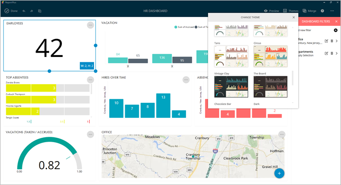
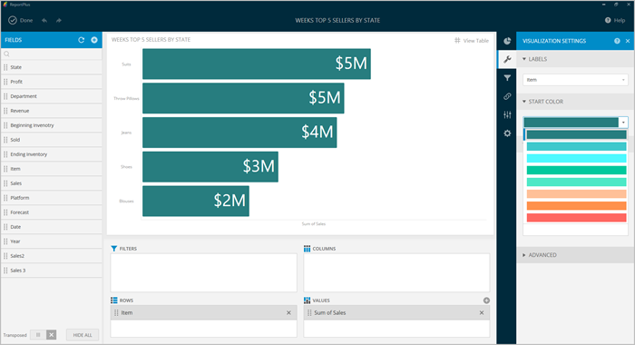

////
|metadata|
{
    "fileName": "dashboard-styling",
    "controlName": [],
    "tags": ["dashboard", "styling", "themes", "change"]
}
|metadata|
////

= Dashboard Styling

ReportPlus makes dashboards styling as easy as choosing a color palette. You can choose from more than 20 different themes.

In order to change dashboard style settings, enter the _Edit Mode_, go to **Themes**,
the first icon in the top right corner, and then select the
desired theme.

In addition, you can also change the Start Color for chart-based widgets. The options available will vary according to the dashboard theme you select.

