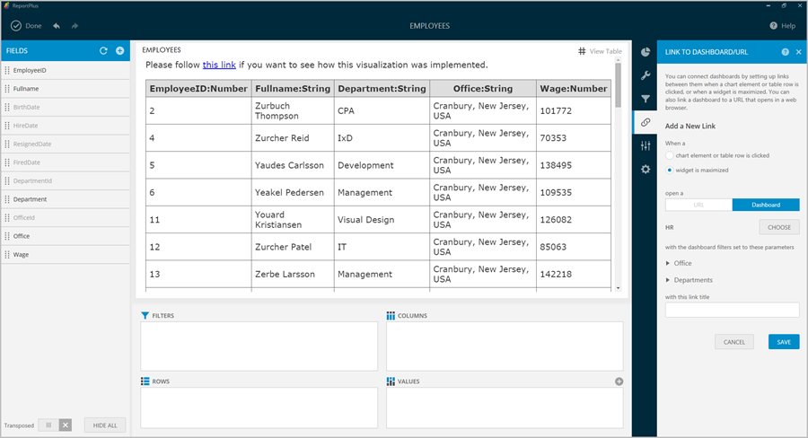

////
|metadata|
{
    "fileName": "diy-visualization",
    "controlName": [],
    "tags": []
}
|metadata|
////

= Do-It-Yourself Visualization

ReportPlus offers multiple components for visualizing data, including the grid view, gauge view, map view and several chart types. There are some cases, though, where you would like to have another visualization method, not supported out of the box, that you feel would be a better fit for your scenario. It is for these cases that ReportPlus introduces the ability to do your own custom visualization component and display it in a widget as part of a ReportPlus dashboard.

To use this custom visualization, you can select the _DIY option_ () from the _Visualizations_ section in the Widget Editor, then click on the _+_ button on the Visualization Settings tab to add the URL address of a web page that generates the custom visualization of your choice. These custom web components can access the data retrieved by ReportPlus from any of the supported data sources. Custom components interact with a Javascript API provided for that purpose.

Web components can be referenced either from a public URL address or from an internal shared location in your intranet.

Keep in mind that:

* If the web components are referenced from a URL, that URL needs to be of public access.
* If the URL Address has an HTTPS:// protocol, every resource referenced in your custom HTML will need to use the same protocol.

A gallery with the following custom html visualizations is provided to be used as samples:

* *Hello World*. It generates a table with the data set retrieved from ReportPlus. At the link:diy-visualization#_creating_a_custom_visualization_step_by_step[end] of this section, there's a step by step tutorial that shows how to reproduce this sample.

* *U.S. States*. Map showing the 50 states of the US. It expects a data set with two columns: the first one with the two-letter state code, the second with a number displayed in the state's tooltip. If conditional formatting is enabled for the number field, then the state's background colors will be set accordingly. For example, the visualization below shows states population with conditional formatting turned on.

* *World Countries*. World Map sample. It expects two columns: the first one with the name of the country, the second with a number used to color each country.

== ReportPlus Javascript API

The Javascript API offers a way for any html page to interface with the ReportPlus application and have access to the data retrieved from any of the supported data sources, and signal events back to the application to enable interactivity. For instance you can create a custom map that reacts to the user clicking on certain regions and triggers the navigation to another dashboard. 

The interactions between the web component and the host can be the following: 

1.*dataReady event handler of the RPBridgeListener object is declared*. 

2.*RPBridgeUtils.notifyExtensionIsReady* is called. This notifies the host that the view is ready to receive the data.

3.*RPBridgeUtils.sendMessageToHost*. Function used by the web component to signal events to host. Receives the following parameters: (message, action, rowData) 

* *message*. There are two possible values:
- *runAction* to signal the host a click took place.
- *openURL* to notify the host to open a url. 
* *action*. Text parameter. If the message is of type runAction, it must match the given name given to Dashboard navigation action.
* *rowData*. Parameter used to pass on to the host the value of the selected data item.

For example, in the example below, the Dashboard Action name was set to "Sample Action". Therefore, the *value* of the *action parameter* for the *runAction message* should be *Sample Action*.

== Creating a custom visualization step by step

This section shows how you can use the DIY Visualizations feature to create your own view of your data. 

It illustrates the following tasks:

* Creating an HTML file and add necessary script references.
* Adding javascript code in order to handle visualization data sent by ReportPlus (the host application) and also signal events. 
* Reading incoming data and creating a custom representation of it.

=== Create the HTML file

Create an empty html file with references to jquery and ReportPlus bridge utils.

The first reference is just to help us manipulating the DOM and the second one has to do with connecting the visualization with the host. 

Once you do this your html code should look something like the following:

    <html>
        <head>
            
            
        </head>
        <body>
    </body>
    </html>

You can also download the _rplus_bridge_utils.js_ file and reference it locally.

=== Notify the host we are ready to receive the data

As a second step we will add the necessary javascript code in order to: 

* Notify the host that the view is ready to receive the data. We do this calling RPBridgeUtils.notifyExtensionIsReady. 
* Register a "dataReady" event handler that will be called by the host after the data is ready to be consumed. 

After this step the code should look like this:

    <html>
        <head>
            
            
            
        </head>
        <body>
        </body>
    </html>

=== Create the HTML elements that will render the custom view

Finally, we process the data sent to the dataReady function, and we generate dynamically the html tags used to render the data. 

In this case we iterate over the tabularData.data array creating table rows and then we add it inside "myTable" div in the HTML DOM. 

        dataReady: function (tabularData) {
         var tableView = $("<table></table>");
            var headerRow = $("<tr></tr>").appendTo(tableView);
            for (var c = 0; c < tabularData.metadata.columns.length; c++) {
                var column = tabularData.metadata.columns[c];
                var headerCell = $("<th></th>").append(column.name + ":" +
                getColumnTypeName(column.type));
            headerRow.append(headerCell);
        }
        for (var i = 0; i < tabularData.data.length; i++) {
            var rowData = tabularData.data[i];
            var rowView = $("<tr></tr>");
            for (var j = 0; j < rowData.length; j++) {
                var cellValue = rowData[j];
                var cellView = $("<td></td>").append(cellValue);
                rowView.append(cellView);
            }
            tableView.append(rowView);
        }
        $("#myTable").append(tableView); }
        };

=== Complete Sample Code

    <html>
		<head>
			
			
			
		</head>
		<body>
			
Please follow <a href="#" onclick="openHelpLink();">this link</a> if you want to see how this visualization 
			was implemented.

			 
			

		</body>
	</html>