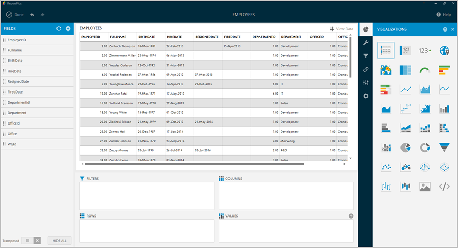
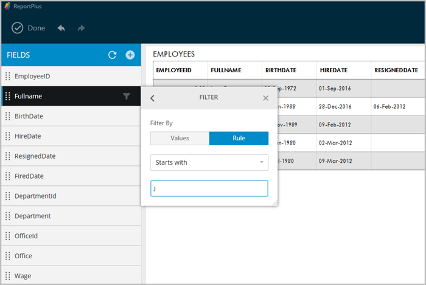

////
|metadata|
{
    "fileName": "data-filters",
    "controlName": [],
    "tags": []
}
|metadata|
////

= Data Filters

This section describes the different options for applying transformations to data sets, such as sorting, filtering, and aggregating data. By applying filters, the information in your reports can be optimized for business analysis. You can remove unnecessary noise, highlight the most valuable aspects, and summarize information in many useful ways.

There are several data filtering options:

* link:#FieldSettings[Field filters] (including link:#VisibilitySettings[visibility], link:#LabelSettings[labeling], link:#FormattingSettings[formatting] and link:#FieldSpecificFilters[field-specific filters]).

* link:#CalculatedFields[Calculated Fields].

* link:#PivotTableSettings[Pivot Table filters] (including link:#QuickFilters[quick filters], link:#CascadingFilters[cascading filters] and link:#pivottablescalcfields[pivot table calculated fields]).

The data filtering options are accessible through the widget editor, which is displayed automatically when a data set is added to the dashboard canvas.

== Widget Editor

The widget editor is the place to go to apply transformations to the data retrieved from the data source, and define its visualization. 

The widget editor has a three-pane structure. The left pane displays the lists of columns of the data table queried from the data source. The central pane displays a preview of the visualization of the data in its upper part, and the pivot table in its lower part. The right hand pane displays initially visualization settings, but you can switch the tab options at the bottom to display parameters settings, page binding or general widget settings. The right lateral panes may be collapsed by clicking on the icon next to the section name in the top bar. 

The left hand pane supports the following actions over the data table: 
[circle]
* *Hide All or Show all fields*. These buttons allows to fast track visibility changes in all the fields at the same time. This is very useful if you need to have only a small subset of columns visible. You can always make all columns invisible and then just change the visibility state for the ones you need to see.
* *Transposing of data table*. The button on the bottom left corner allows for the user to switch columns for rows. Only the first 50 rows are transposed.
* *Adding calculated or hierarchical fields*. The + button on the left top bar allows to link:http://help.infragistics.com/reportplus/data-filters#CalculatedFields[add calculated or hierarchical fields].

[#FieldSettings]
== Field Settings

To display the column settings dialog you must click on the field's row on the list of columns displayed on the left pane of the widget editor. This will display a popover with the dialog. 

Field settings include the following:

[circle]
* *Changing link:#VisibilitySettings[visibility]*.
* *link:#LabelSettings[Label] renaming*.
* *link:#SortingSettings[Sorting] data*. 
* *link:#FormattingSettings[Formatting] rules for the column*. 
* *Applying link:#FieldSpecificFilters[filters]* by Rule or Values (including empty ones).

Columns of type *Date* additionally support *turning on Fiscal Years formatting*, and, when aggregated in the pivot table, also allow you to configure the granularity level of the aggregation in Days, Months, Years.

[#VisibilitySettings]
=== Is Visible

The first option in the column's settings is to change the visibility settings. This setting allows you to remove a specific column from the data set for the current widget. 

[#LabelSettings]
=== Label

This option allows renaming column's labels. It's for display purposes only as fields are always referenced by their original name in calculated field expressions. Once renamed, erase the label completely to go back to the original value.

[#SortingSettings]
=== Sorting

To sort by a column, click on the desired sorting orientation, ascending (Asc) or descending (Desc) in the Sorting switch control of the column's settings pane. When sorting is enabled for multiple columns precedence is given by the columns position on the data set.

Enabling sorting on a column is signaled in the fields listing on the left pane with an arrow icon.

[#FormattingSettings]
=== Formatting

Numeric and Date fields enable a formatting option in the settings dialog.

To format date fields, select the desired date/time format you want to display from a list of possible options.

In the case of numeric fields, the options are more sophisticated. The user has the ability to configure:

[circle]
* *Number Format*. Whether to display the number as percentage, currency, or number.
* *Fraction digits*. The amount of digits to display to the right of the decimal point.
* *Show 1000 separator*. Configures whether to display or not the thousands separator.
* *Large Number Formatting*. This will display _M_ for millions and _K_ for thousands within the visualization preview in the central pane.
* *Negative numbers*. Allows you to select between enclosing negative numbers in parenthesis or prefixing with the minus symbol.
* *Currency Symbol*. Allows the user to choose from several currency formats. 

[#FieldSpecificFilters]
=== Filters

*_Filter empty values_*

ReportPlus provides the ability to filter rows in the data set that have null or empty values on a specific column by enabling the filter empty values configuration setting.

*_Filter by values_*

This type of filter supports the definition of the set of values to display for a column, filtering every other value. To enable this type of filtering, click on the _Selected Values_ configuration setting. This in turn displays the list of possible values for a column, and there you tap to mark only the items you want to remain in the data set. Rows with values excluded by the filter aren't displayed in the column.

*_Filter by rule_*

Filter by rule enables the definition of more complex rules. The available rule options change depending on the nature of the data type of the selected column, and are explained in detail in the following sections.

*_Rules for numeric fields_*

Fields of numeric types such as: integers, decimals and currencies, support the following type of rules:

[circle]
* Top Items
* Top Percent
* Bottom Items
* Bottom Percent
* Above Average
* Above
* Above or Equals
* Below Average
* Below
* Below or Equals

All these rules take one parameter, which by default is set to 10, but that can be changed to be any numeric value by entering the desired value in the white text box below the listed rule types. By default, when filter by rule is enabled on a numeric field, it's set to Top 10 Items.

Rules such as Top & Bottom 10 don't necessarily mean that 10 items will be retrieved. It filters the Top or Bottom 10 values, and, if there are multiple items with the same value, then more than 10 values will make the cut. For instance, the top 10 countries with more sales, may yield 12 countries because the last three countries have the same amount of sales.

*_Rules for string fields_*

Text columns support the following type of rules:

[circle]
* Equals
* Contains
* Starts with
* Ends with

Similarly, these rules also take one parameter: the value of the 'starts with', or 'equals' that the rule is going to use to evaluate, and is entered in a textbox in the same position.

[#CalculatedFields]
== Calculated Fields

ReportPlus Desktop allows you to define new fields in the data set, named calculated fields. These fields are built based on expressions that may compose existing fields, constant values, and a set of predefined functions. In order to add a new calculated field, you must click on the + button in the top bar of the left hand panel. Once you do it, you will be prompted to enter a name for the new field and the expression to calculate the value of the field.

The following are a set of calculated field sample expressions:

|===
|Field Name |Expression |Sample Output

|AGE
|(TODAY)-[BirthDate]/365
|33.5

|FULL NAME
|[FirstName]&" " &[Surname]
|John Smith

|SALES PERCENTAGE
|[Sales]*100/SUM([Sales])
|24.233

|SALES PERCENTAGE DELTA
|([Sales]-PREVIOUS([Sales],1))*100/PREVIOUS([Sales],1)
|1.03

|NAME STARTS WITH _L_
|IF(FIND("l",LOWER([FirstName]), 1)=1, "Starts with 'L'", "Other: &MID([FirstName], 1, 1))
|Starts with 'L'

|EVENT DATE
|DATE([EventDate],[EventMonth],[EventDay])
|8-Feb-2013

|DEVIATION FROM AVG
|[Salary]-AVERAGE([Salary])
|32500
|===

*Calculated fields created this way are evaluated prior to executing pivot table aggregations. If you need calculation to take place after the summarization of the pivot table then you should use link:#pivottablescalcfields[Pivot Table Calculated Fields]*.

The use of these types of fields is suitable when: 
[circle]
* There's a need to analyze derived information. For instance, if a data set has values, per day, it might be interesting to chart the variation between days as a percentage of the total.

* There's a need to bind widget information with pages binding, but neither the pages data set nor the widget data set has the columns data in the expected format. In these cases, creating a calculated column with a more "massaged" format may help make possible the join between data sets. 

[#PivotTableSettings]
== Pivot Table

A Pivot Table is a data summarization tool, which among other functions allows you to automatically count, average and total the data stored in a table like format, typically grouped by values. For instance if you have the following table: 

[width=50]
|===
|Salesman |Region |Product |OrderID | OrderTotal

|JOHN A.
|Americas
|ProductX
|1001
|10

|ERICK B.
|Americas
|ProductY
|1002
|20

|PETE C.
|EMEA
|ProductX
|1003
|30

|DAVID D.
|China
|ProductZ
|1004
|10

|JORGE E.
|Australia
|ProductY
|1005
|5
|===

And you need to do the following type of analysis:

[subs="quotes"]
++++++++++++++++++++++++++++++++++++++

++++++++++++++++++++++++++++++++++++++
[width=60]
|===
| |Americas |EMEA |China |Australia |Total

|PRODUCTX
|10
|30
|
|
|40

|PRODUCTY
|20
|
|
|5
|25

|PRODUCTZ
|
|
|10
|
|10
|===

You can achieve it by using a Pivot Table where:

* The _Product_ field is dragged and dropped in the *Rows* placeholder so that all products are listed as rows.

* The _Region_ field is dragged and dropped in the *Columns* placeholder so that columns are created in a dynamic table for every value in the _Region_ field.

As part of the Widget Editor, ReportPlus provides a Pivot Table Editor at the bottom of the center section, which allows the user to aggregate information by dropping fields in the corresponding placeholders of the Pivot Table.

When a field is added to the rows, columns, or values pivot table placeholders, clicking on the field displays the summarized settings of that field:

* For the fields in the *Values* placeholder, this means the ability to configure the summarization function used (average, count, sum, etc.).
* For date fields dropped in the *Rows* placeholder, it means the ability to choose the level of detail in the summarization (hour, day, month, year)

[#QuickFilters]
=== QuickFilters

Column filters defined in the column settings become part of the dashboard definition, and can't be modified by consumers of the dashboard. On the other hand, when designing the dashboard, Quick Filters allow you to establish filters that can be dynamically changed, like parameters, by dashboard users without editing the dashboard. 

In order to define a quick filter, drag and drop a column in the Filters placeholder of the pivot table.

image::images/DataFilters/PivotEditorViewQuickFilter_Desktop.png[PivotEditorViewQuickFilter_Desktop]

The quick filter will be displayed under _Widget Filters_, in the right hand pane, when the widget is maximized in the Dashboard view mode. As with link:http://help.infragistics.com/reportplus/dashboard-filters-and-binding[Dashboard Filters], this enables a dynamic filtering of the widget contents as the quick filter selection changes.

The filter options displayed in the _Widget Filters_ area depend on on the data type of the field. There are three different filter dialogs: text, numeric and date fields.

[#CascadingFilters]
=== Cascading Filters

The list of possible values displayed to select from in QuickFilters will be filtered based on previous QuickFilters selections. Fields on the left take precedence and determine the list of possible values on filters to the right. For instance, if the field "_Country_" is dropped first, and the field "_City_" is dropped second, the list of shown cities will be filtered by the current country selection.

[#pivottablescalcfields]
=== Pivot Table Calculated Fields

You can add calculated fields to a pivot table that will rely on already summarized values. This is useful to apply arithmetic operations between metrics in the values placeholder. For instance given the following summarization in the pivot table: 
[width=25]
|===
|Orders Count |Orders Total $

|5
|75
|===

You could add a calculated field on the pivot to analyze the average order size with the following expression: [Orders Total $]/[Orders Count], which would result in the following table: 
[width=50]
|===
|Orders Count |Orders Total $ |Average Order Size

|5
|75
|*15*
|===

Pivot Table Calculated Fields in the pivot table are added by clicking the button for that purpose in the values placeholder. 

