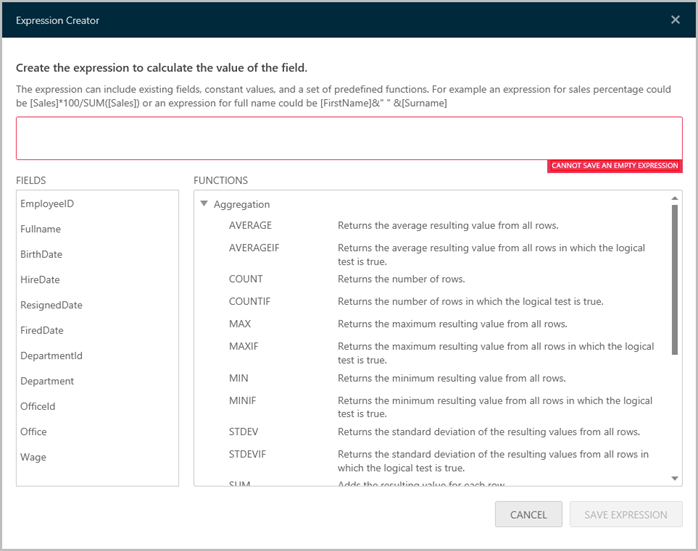

////
|metadata|
{
    "fileName": "dashboard-filters-and-binding",
    "controlName": [],
    "tags": ["data filters"]
}
|metadata|
////

= Dashboard Filters and Binding

ReportPlus Desktop allows the configuration of Dashboard Filters as a means to easily slice the contents of all the widgets in a dashboard all at once. The data sets added to the Dashboard Filters collection remain in context for all dashboard widgets to be link:#BindingSettings[bound to], enabling link:#DynamicFilters[dynamic filtering] of the widget contents as the filter selection changes. For instance, a data set with the list of locations around the world or a company's Departments can be added to enable binding all widgets of a dashboard. In this scenario, the contents of each widget can be filtered by department or location by the user browsing the information in that dashboard. Other widget binding options include link:#FieldBinding[field], link:#ParameterBinding[parameter] and link:#URLBinding[URL] binding.

ReportPlus Desktop also supports link:#DashboardVariables[what-if analysis] and activating a link:#DateRangeDashboardFilter[Date Range dashboard filter]. This enables filtering all widgets by a specific period of time. If you wish to collapse the _Dashboard Filters_ pane, simply click on the "X" by the *Dashboard Filters* section. To expand it, click on the _Show Filters_ filter icon in the right-hand pane.

== Configuring Dashboard Filters

The dashboard filters dataset is defined by entering Edit mode. To add a new dataset, just click the Add New Filter "+" sign.

This will result in the display of a list with the possible dashboard filters to be applied. You can choose between:

* *Adding a link:#DateRangeDashboardFilter[Date Filter]*. This option will allow you to choose a fixed range, or customize it to show only a specific date range.
* *Adding a link:#BindingSettings[Dashboard Filter]*. This option will allow you to choose information from a Data Source.
* *Adding a link:#DashboardVariables[Dashboard Variable]*. This option will allow you to include a what-if analysis scenario.

ReportPlus attempts to locate the first column whose title contains the text _Name_, to use as label of the filter. If it doesn't find one, it will select the first column with the type String as label.

You can change the displayed column in Edit mode by clicking the Edit button next to the dashboard filter's name. From this dialog, you can change the displayed field, as well as apply sort and filtering to the dataset columns, and enable multiple selection.

To remove a dataset from the dashboard filters list, just click on the Delete button next to the filter's name.

[#BindingSettings]
== Binding

Binding dashboard widget's data to a dashboard filter can be done in two ways: either as part of the Dashboard Filter configuration, or in the _Dashboard Filter Connections_ section, which allows to centrally configure the binding between a dashboard filter and all widgets in a dashboard. 

Otherwise, a widget can be bound to a dashboard filter within the widget settings in the _Dashboard Filter Connections_ section. To open the binding pane, click on the Filter icon in the top right of the widget editor.

In both cases, the binding is defined by adding rules that link a field in the dashboard filter data set with a corresponding field in the widget's data set ("*field binding*") or one of the widget's data source parameters ("*parameter binding*").

[#FieldBinding]
== Field Binding

Field binding allows you to configure a join relationship between the dashboard filter dataset schema and the widget's data schema. To do this, click on the Dashboard Filter you want to use in the _Dashboard Filter Connections_ dialog:

In this dialog, you must configure:

* *Widget field/parameter*. This represents the column in the widget's dataset that will be used as key to join with the dashboard filter dataset. For example: EmployeeId, ProductId, DepartmentId, etc.
* *Operators*. The join operators to use, which can be one of the following:
- *EQUALS*. Requires that both the field value and the dashboard filter selection be equal.
- *CONTAINS*. Meant to be used with fields of type String; returns a match enables the join when the field value contains the dashboard filter selection. For instance: Field value='FRANCE' CONTAINS Page selection='FRA'.
- *BETWEEN*. Only available when the configured field is of type Date, meant to be used wit the Date Range dashboard filter.
* *Dashboard filter field*. The specific dashboard filter from the dashboard filters list that will be joined.

[#ParameterBinding]
== Parameter Binding

The data sets used in the creation of a dashboard may have parameters depending on the data source they were retrieved form. For instance, if an Excel spreadsheet is used as a widget's data source, then it will have as parameters the _Sheet Name_ used, and the range of cells within than sheet. On the other hand, data sources such as link:advanced-data-sources-configuration#WorkingWithMicrosoftReportingServices[Reporting Services] reports have their own parameters which are defined as part of the report definition.

Dashboard Filters allow to modify these parameters dynamically depending on the value selection in the dashboard filter. This can be used for instance to target different sheets within one same Excel spreadsheet. On occasion Excel spreadsheets have different sheets with the same structure of data, but with different dimensions of analysis, such as different months, or different clients, etc. Parameter binding enables to switch the Excel sheet used, or the parameter sent to the server with a simple click in the dashboard filters list. 

In order to configure Parameter binding, you must go to the Dashboard Filter Connections section in the Widget Editor:

Select the Widget fields/parameters option in the segmented control. This will bind the selected dashboard filter to the parameter of the widget data set.

[#URLBinding]
== URL Binding

For some data sources, there's another type of binding available called URL binding, which allows you to link dashboard filters to data sets or assets that can be retrieved with a URL, such as in link:how-to-configure-data-sources#SharePointServer[SharePoint], link:how-to-configure-data-sources#ODataService[OData] and link:how-to-configure-data-sources#WebResource[Web Resources].

If this is the case, then a different configuration option is made available in the Binding Pane. You will be able to turn on URL Binding, and define a URL Binding Path expression.

This feature enables the report to query different items dynamically from the data source, depending on the dashboard filter selection. This matching is based on a dynamic path and not on field rules between the datasets.

image::images/DashboardFiltersandBinding/PivotEditorViewURLBinding_Desktop.png[PivotEditorViewURLBinding_Desktop]

For instance, the tasks list of a SharePoint Project site could be retrieved with an expression as follows:

*/projects/[ProjectName]/Tasks*

Where _ProjectName_ is the name of a column in the Dashboard Filters dataset.

The URL Binding Path editor requires you to select a dashboard filter to do the binding, and provides the following assistance:

* It provides the base static URL to act as starting point.
* By selecting the dropdown, the user is able to select from a list of column names in the dashboard filters dataset.

image::images/DashboardFiltersandBinding/PivotEditorViewURLBindingIntellisense_Desktop.png[PivotEditorViewURLBindingIntellisense_Desktop]

[#DateRangeDashboardFilter]
== Date Range Dashboard Filter

ReportPlus supports enabling a range of dates as dashboard filters to bind to. This enables time based analysis scenarios, changing one data range and filtering the whole dashboard.

In order to enable the date range in the dashboard filters section, you must click on the _Add Date Filter_ button.

The default Date Range selection is "Last Week". Once the date dashboard filter is enabled, it becomes available for use in field binding expressions.

== Displayed Column

This setting specifies the current data set's column that will be used to display values in the Dashboard Filter. Listed values will not be repeated even if they appear multiple times in the data set.

== Multiple Selection

ReportPlus supports the selection of multiple dashboard filter values simultaneously. This is meant to enable side by side comparison between different elements in a collection. For instance, in the _HR Dashboard_ dashboard you can compare the hires and absences over time of different offices by enabling multiple selection.

In order to enable multiple selection you must switch the dashboard to the Edit mode. In the Dashboard Filter section, select the _Allow Multiple Selection_ option. This will turn on the Multiple Selection mode for that specific dashboard filter dataset.

== Required Selection

Dashboard filters can be configured to require a selected option or not. By default, a selection is required. Making selection optional allows the user to click on the selected row to deselect it, which removes the filter from the performed query. The query retrieves all data from the data source and _No selection_ is displayed in the dashboard filters row. Sometimes this may not be recommended; for instance, for user experience implications, since all charts being cluttered with tens of data series makes the data hard to read. It's up to the dashboard's author to determine which the best option is.

[#DynamicFilters]
== Dynamic Filter

Enabling the _Dynamic Filter_ setting *Is Dynamic* on a data set dropped in Dashboard Filters enforces a cascading filters behavior on the list of displayed values in Dashboard Filters. If the same data set is dropped more than once, the second filter will honor the selection made in the first one and show a list of values already filtered by the current selection. For instance, if a data set is dropped containing both Countries and Cities, and the first filter is used to display "_Country_" as the Displayed Column, and then the field "_City_" is dropped second, the list of shown cities will be filtered by the current country selection.

Disabling this option forces to display all the existing values in the data set for the displayed column. If the same data set is used for a third time, it will honor the selection in the second filter, despite the Dynamic Filter configuration of the second filter.

== AutoPlay

In Dashboard view mode, the dashboard filters pane displays a Play icon on top. When clicked, a slideshow automatically changing the values of the selected dashboard filter, with a delay of 5 seconds in each dashboard filter.

[#DashboardVariables]
== Dashboard Variables

With Dashboard Variables, ReportPlus brings the what-if analysis, also known as sensitivity analysis, to the table. This type of analysis is commonly used to determine how different values of one external variable will impact other dependent variables in a given scenario.

ReportPlus-related examples are:

* A dashboard with forecast analysis that includes a variable with the interest rate value.
* Dashboards about profit margin of a new product, with fixed and variable costs.
* A dashboard about sales projections that ultimately depend on a specific large deal with a big company or the exchange rate used at the time of a transaction.

=== Creating Dashboard Variables

To create a new dashboard variable in Edit mode, just go to Dashboard Filters in the right corner of the screen and click "Add what-if scenario". Finally, give the dahsboard variable a name, data type and value.

=== Using Dashboard Variables

Dashboard Variables referenced in widgets work like Dashboard Filters and can be changed dynamically while you are browsing the dashboard. But, unlike Dashboard Filters, they are not restricted to a set of predefined values and can instead take any value you enter.

A particular widget can reference Dashboard Variables through calculated fields and widget binding.

==== Calculated Fields

When working with calculated fields, you can reference a dashboard variable using a new function (VARIABLE). This function receives a text parameter with the name of the referenced dashboard variable.

==== Widget binding

Once a dashboard has at least one dashboard variable created, a new data set is made available for widget binding. The new data set (Dashboard Variables) contains a field for every dashboard variable