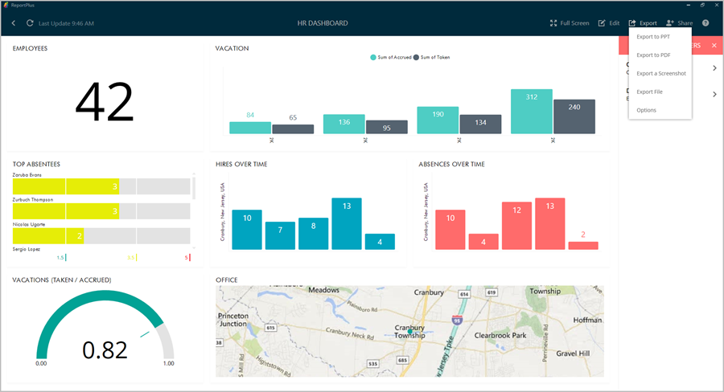

////
|metadata|
{
    "fileName": "export-options",
    "controlName": [],
    "tags": [] 
}
|metadata|
////

= Export Options

The information displayed in dashboards will change over time as the data changes in the data source, but there will be scenarios where you will profit from sharing a snapshot of the data in that specific moment in time. For instance to highlight an unexpected value, that may provide some business insight and requires attention right away. Also the dashboard format which allows to pack a lot of information in a single view may not be the best format to provide a more detailed, and corporate branded, walk through and discussion around the information upon sharing. For these cases, ReportPlus provides the ability to generate a branded document with a snapshot of the current state of the dashboard’s widgets, annotate it, and email it. This way, you can share any conclusion or insight derived from the data in an easy way to understand for anyone in the company, and also to serve as report to be stored over time. In order to access the export feature, you must navigate to the dashboard and then click the "Export" button in the top-right corner.

Supported export formats are the following:

* *PowerPoint Slide Deck*. A capture of the dashboard widgets as a collection of annotated slides. Suitable for presenting the information to groups of people, one slide at a time.
* *PDF Document*. A read only PDF document, that generates one page for each widget’s capture, and corresponding annotations.
* *Screenshot*. A screen capture of the dashboard.
* *File*. The dashboard exported locally.

== Export Settings

ReportPlus Desktop allows you to configure a set of export settings which empower you to customize the generated document to better suit your needs. You can access these options through the _Options_ menu in the "Export" menu on the right side of the top bar. 

From this dialog you can configure the following settings:

* **Author Names**. Name that will be used in the generation of the report as author of the document. This entry is optional. 
* **Company Name**. Name of the company that will be used in the document if the Company Logo is empty. This entry is optional.
* **Company Color**. The color that the brand is most identified with. It’s used to brand the generated document. You can select it by entering a named color or a RGB hexadecimal format.
* **Company Logo**, which you can choose from a file in your computer or within a URL.

Advanced Settings are:

* **Max Number of Columns**. Whenever a widget with a grid visualization is exported, ReportPlus will generate a table. By default only the first 8 columns are displayed, to make sure the information is not crammed and remains readable. You can tailor this figure if you want more or less columns displayed for grid visualizations.
* **Max Number of Rows**. This setting allows to customize the number of rows that are exported for widgets with grid visualizations up to a maximum of 200.

== Export Scope

Dashboards with Dashboard Filters will display the export scope panel, which allows you to choose between the following two export types:

* **Current Values**: The export generation takes place as if no Dashboard Filters have been defined, and generates one page per widget with the current values, given the current filters selection.
* **Multiple Filter Values**: ReportPlus will traverse the first data set defined in Dashboard Filters, and for each of the selected values it will generate a different page.

== Report Pages

This step in the export process is meant to allow you to select which widgets, or dashboard filter values, are going to be used in the export process.

If the dashboard has dashboard filters defined and the export scope selection is multiple values, then for each dashboard filter value a row will be displayed in a list. Otherwise, the list contains one row for each widget. From this list, you can select which elements are to be included in the generated document by switching the Visible control contained in each row.  No more than 50 elements can be included in the export.

Upon clicking on the Export option, you will be taken to the above page detail view, which allows you to change the title and add text notes to a page.

== Sharing the exported Report

You can save, email or open the report by clicking the corresponding option in the _Export_ dialog.

