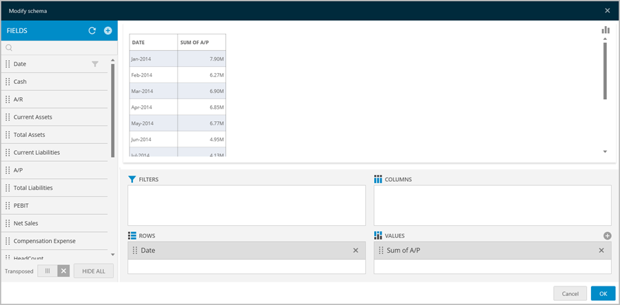
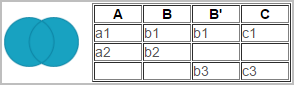

////
|metadata|
{
    "fileName": "multiple-data-sources",
    "controlName": [],
    "tags": ["multiple","data sources","composite"]
}
|metadata|
////

= Multiple Data Sources

You can combine data from multiple data sources into one data set either by link:#CreatingMultipleDataSourcesConnection[creating a _Multiple Data Sources_] connection or by link:#mergingwidgets[combining widgets in a dashboard]. This enables mashing up data from different enterprise systems to analyze it and chart it side by side in the same dashboard widget. For instance, you may compare web site visits over time retrieved from Google Analytics with sales figures coming from an enteprise ERP system to gain insight about the correlation of those two variables.

Once a new Multiple Data Sources connection has been created, it can be used to create dashboards as any data set in ReportPlus. It remains listed under the Recent Data Sources section in the data sources catalog, so it can be reused in different dashboards.

[#CreatingMultipleDataSourcesConnection]
== How to create connections to Multiple Data Sources

Connections to Multiple Data Sources can be created by clicking the + button on the data sources pane and selecting the _Multiple Data Sources_ option located at the bottom of the dialog.

image::images/MultipleDataSources/NewCompositewizard_Desktop.png[NewDataSourceWizardDialog]

To second, and most straightforward way of working with Multiple Data Sources, is using the _Merge_ menu while in Edit Mode. Click on *Merge* and select the two widgets you want, and proceed to link:#mergingwidgets[merge the widgets].

image::images/MultipleDataSources/CompositeNavBar_Desktop.png[CompositeNavBar_Desktop]

In order to create a new Multiple Data Sources connection, you have to configure the following:

* *Name*. Name of the new combined data source.
* link:#DataSetstoCombine[*Data sets to combine*]. You must browse the existing data sources and select two data sets to combine. For instance, GAAP REVENUE and A/P.
* link:#JoinCondition[*Join condition*]. The value condition that needs to match for two rows to be joined. For instance [A/P].Date = [GAAP REVENUE].Date.
* *The behavior for rows that don't match*, which can be one of the following:
- Discard Data
- Keep A Data
- Keep B Data
- Include All Data
* *Selected Fields*. Fields to carry over the combined data set.

[#DataSetstoCombine]
== Data sets to combine

The definition of a Multiple Data Sources connection requires that you configure two data sources to merge. If you need to combine more than two, you can generate a first connection with only two data sources and later add another Multiple Data Sources connection combining the first one created.

Once you browse and select a data set, you can configure filters, pivot table summarizations, or add calculated fields.

Calculated Fields, for instance, give a good degree of flexibility when joining two data sets, as they allow users to make adjustments and apply transformations to field values in order to suit them better to the join condition.

If you want to change one of the selected data sources, you can click on the "Data Set 1" or "Data Set 2" buttons. This will take you to the _Choose Data Source_ dialog and let you select an existing or new data source.

[#JoinCondition]
== Join condition

The join condition dialog allows you to configure two things: the equality condition needed to link rows of different data sets and the criteria of what to do when the condition is not met.

For instance, take a look at the following data sets, which have been joined with a B=B' condition:

The criteria definition allows the following type of behaviors for the join operation:

Discard all non-matching rows

Include all left

Include all right

Keep all on both sides

By adding a calculated field, it's possible to create a column containing all values of B and B'. Adding a calculated field named B+ with condition: _IF(ISEMPTY([B]),[B'],[B])_ allows charting using the B+ column in the x axis. For example, charting metrics over time using Date columns with different names. For the proposed example this would generate the following data set:

[#mergingwidgets]
== Combine by merging widgets in the dashboard

By using the merge function in the Dashboard Editor, you will be able to combine two existing widgets and aggregate their information, thus building a new widget.

After clicking the "Merge" button, you will be prompted to select two widgets from the dashboard. As soon as the second widget is clicked, the Multiple Data Sources dialog prompt comes up with the data sets preloaded.

This new dialog will guide you through the merging process, for which you will need to provide:

* A *name* for your combined widget. By default, the name will be auto-filled with the combined name of the widgets you have chosen.

* The *join condition* to link the two data sets and a *behavior for rows that don't match*. ReportPlus automatically attempts to determine the join condition given the two selected data sets. It will take into account the configuration of the visualization type, the pivot table configuration (if any), and the name and type of the fields to find matches. If ReportPlus doesn't automatically find a probable join condition to load, it falls on the user to define the join criteria.

* The *fields* that will be displayed in the combined data set.  

In some scenarios, when merging charts or pivots with compatible field types, ReportPlus will automatically generate a calculated field containing the union of the two fields participating in the join condition to facilitate the analysis process. For instance, when analyzing metrics over time, if the join is based on the Date fields, ReportPlus will generate a new Date field to allow charting metrics coming from the different data sets over time as well.

Once all the required fields are entered in the dialog you must click on the Ok button. This will create a new widget in the dashboard canvas with the merged data set ready to be used in dashboard creation. The visualization of the resulting widget will be a Grid View by default, but it can be set to a chart type with more than two series for a better visual representation.

