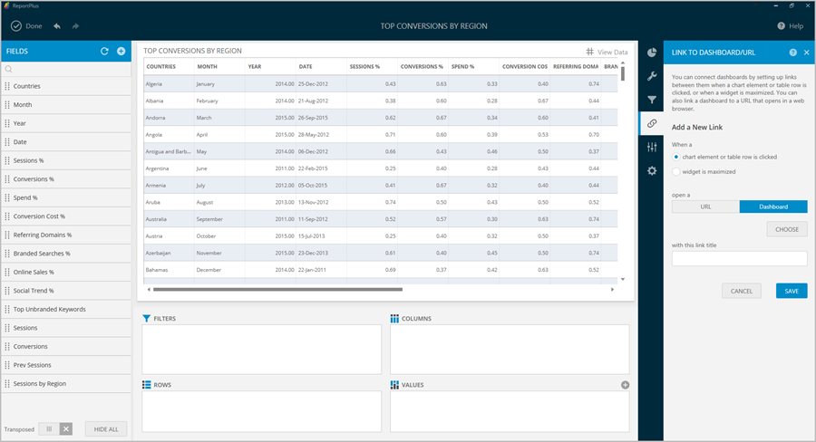
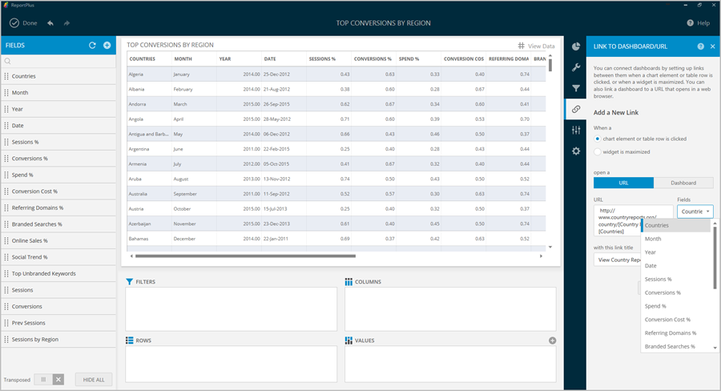

////
|metadata|
{
    "fileName": "navigation-between-dashboards",
    "controlName": [],
    "tags": []
}
|metadata|
////

= Navigation Between Dashboards

ReportPlus supports the navigation between dashboards triggered by specific events, such as:

* Maximizing a widget.
* Clicking on a grid row.
* Clicking on a chart/column bar.

This feature takes the concept of drill down navigation to a new level; for instance, if you want to provide more detail on the information displayed in a widget, you can use a whole new dashboard to do so. This can be very useful to establish top down analysis paths, where you go from a high level overview of the reality of a business to more detailed views with the specifics.

One example is the implementation of a Company 360 dashboard, which provides key performance indicators for each area. Once you click on any of the widgets to maximize it, ReportPlus opens another dashboard with more details for the selected department. 

It's possible to associate actions to specific events. Opening another dashboard is one of two supported actions. The second one is opening a URL. This enables extensibility scenarios such as interacting with third-party web applications as part of the dashboard navigation.

In order to configure this feature, you must select the _Link to Dashboard/URL_ section, which displays the following configuration dialog:

== Events

The control on top of this dialog selects the event or trigger that will be used to fire the action. Possible options are:

* *Chart element or table row is clicked.* The event is triggered whenever a user clicks on a row in a grid view; however, in other visualization methods such as charts, it's triggered when you click on a data item of the chart, such as a column or a bar, depending on the chart type. 

* *Widget is maximized*. This event is triggered whenever a widget is maximized in the dashboard view.

== Actions

Possible actions when an event is fired are:

* *Open Dashboard*. Enabling this action will open another dashboard when the selected event takes place. If the selected dashboard happens to have dashboard filters, you will need to configure how to populate it for each dashboard filter. Available options are:

- *Column*. Get the value from one of the columns of selected row.

- *Literal*. Manually enter a fixed value.

- *Dashboard Filter*. Get the required value from one of the dashboard filters of the starting dashboard.

* *Open URL*. Enabling this action will open the configured URL in the browser. There are three parameters you will need to define:

- The *URL Action* to take place once a chart element or table row is clicked.
- The *Link Title* the users will see.

For example, let's take a look at the following dashboard:

* The *URL Action* was set to:

  http://www.countryreports.org/country/[Country Name].htm
  
Where _[Country Name]_ is an actual column in the data.

* The *Link Title* was set to _View Country Report_.