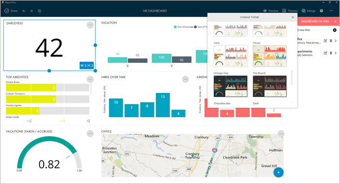

////
|metadata|
{
    "fileName": "configuration-settings",
    "controlName": [],
    "tags": []
}
|metadata|
////

= Configuration Settings

This section has information on the configuration options available in ReportPlus, which can be divided in link:#AppGeneralSettings[application or general settings], link:#DashboardSettings[dashboard], link:#StyleSettings[style], and link:#WidgetGeneralSettings[widget] settings.

[#AppGeneralSettings]
== General Settings

General settings affect the application’s behavior for all your dashboards. They can be accessed by going to the Settings section in the initial view.

The available configuration options in General Settings are:

* *My Account*: 
- *Accessing your account*: To Access ReportPlus Desktop, enter your username and password.
- *General Settings*: Allows you to manage your data sources and to define whether the Welcome Screen is showed at Startup or not.
- *Resetting the Cache*: The Reset Cache option forces the deletion of all cached contents, for all dashboards. Note that when applying this option while offline, some dashboards may not be displayed. Dashboards that rely on external data sources (not in Local Files) will be unable to retrieve their data.

* *Credentials*: Centralized access and management of all the accounts you need for your data sources.

* *Manage Subscriptions*: Centralized access, management and upgrade of your ReportPlus Desktop subscriptions. 

[#DashboardSettings]
== Dashboard Settings

These settings affect the behavior of the current dashboard only. They can be accessed by selecting _General Settings_ in the top-right _actions menu_. The available configuration options are:

*  *Dashboard Title*. Short text to be used to identify the dashboard, also displayed in the initial view.
* *Dashboard Description*. Long text that states the purpose of the dashboard. It's used when exporting the dashboard to a slideshow.
* *Auto Refresh*. When configured, it refreshes the dashboard on a given interval (2, 5, 10, 30 or 60 minutes).

While in Edit Mode, you can also access the overflow menu in the top right corner to:

* *Change Data Sources*. This option prompts a wizard to guide you while connecting the dashboard to a schema compatible data source.
* *Preview your dashboard*. This option allows you to preview the dashboard in mobile devices. 

[#StyleSettings]
== Style Settings

These settings configure the theme of a dashboard. Applying a theme updates the visualization color palettes as well as the widget and dashboard background.

The style settings can be accessed in _Edit_ mode by clicking the _Themes_ button.

[#WidgetGeneralSettings]
== Widget General Settings

The available configuration options in a widget's General Settings are:

* *Title*. Short text used to describe the contents of a widget in the dashboard.
* *Show Title*. Display or hide the widget's title bar.
* *Expiration*. The fixed duration for the data retrieved from the data source. By default, data from the local cache (that has not expired) will be used instead of querying the data source.

The following data source settings are read-only and meant to be informative only.

* *Last Update*. Last time the data was retrieved from the widget's data source. 
* *Name*. Name of the data set retrieved from the data source. For instance, if the data source is a database, it will display the name of the table or view the data is coming from. This is informative and read-only.
* *Type*. The type of file retrieved from the data source. For instance, if the data source is an Excel file, it will display a "LOCALFILE" label.
* *Path*. Path in the data source to the data set used by the widget. For instance, if the data set comes from a link:how-to-configure-data-sources#MicrosoftSQLServer[Microsoft SQL server], this option will display the Database Name, Table and Schema. On the other hand, if the information comes from a link:how-to-configure-data-sources#SharePointServer[SharePoint] connection, it will display the route in the server to the list or the document within a document library.