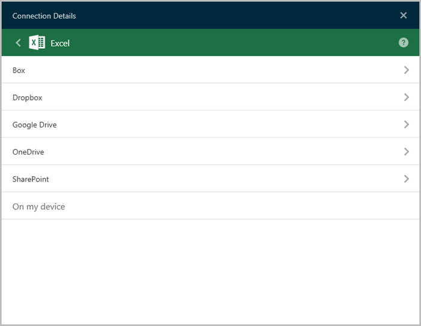
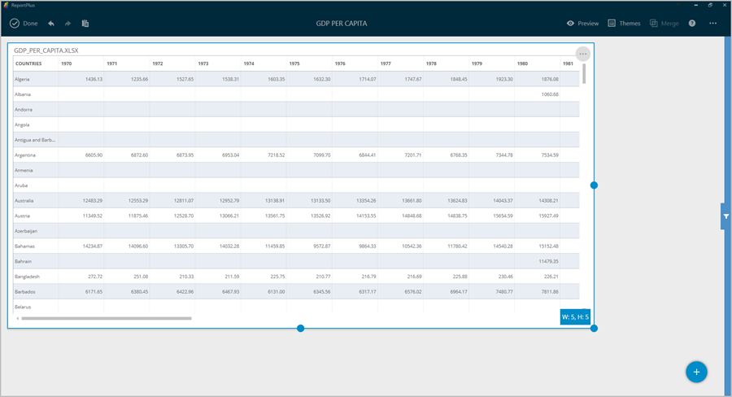
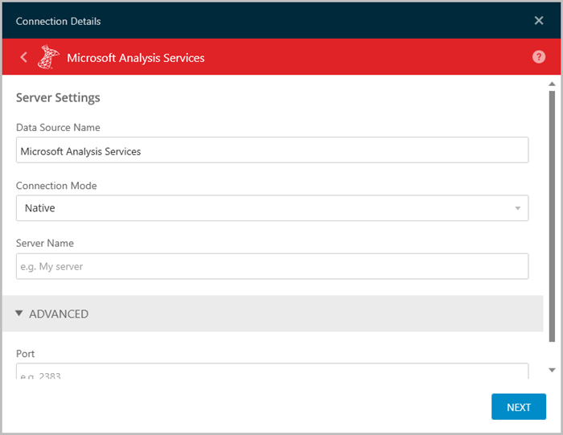
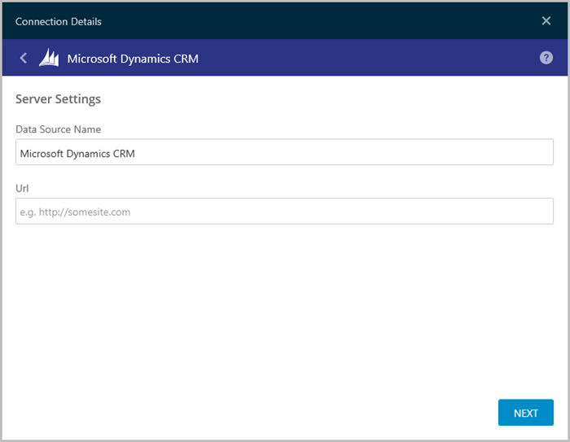
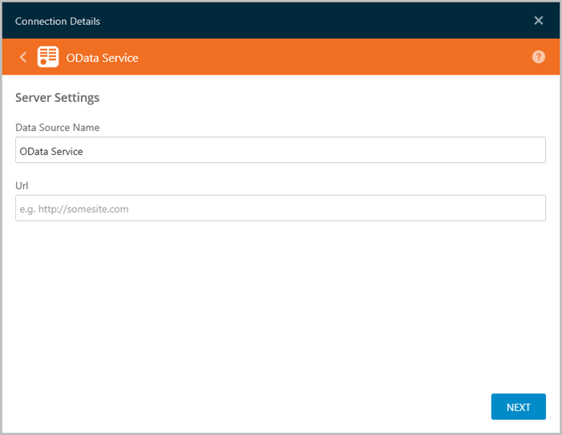
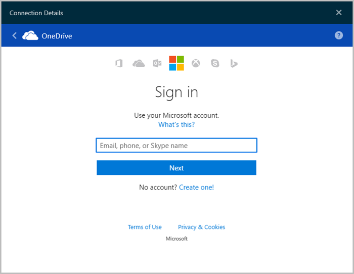
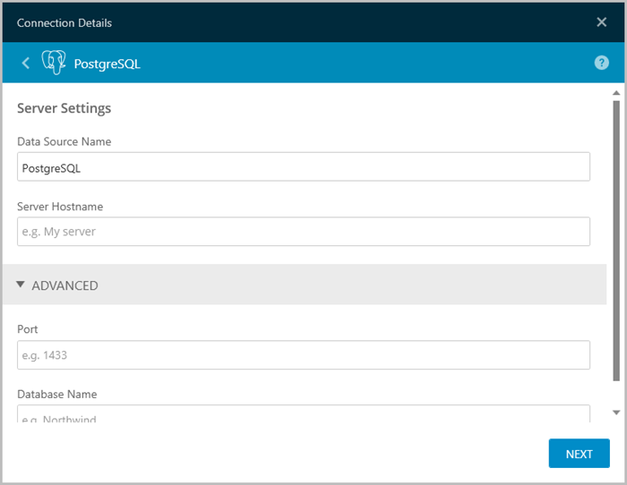

////
|metadata|
{
    "fileName": "how-to-configure-data-sources",
    "controlName": [],
    "tags": []
}
|metadata|
////

= How to Configure Data Sources

As mentioned in the Getting Started section, ReportPlus provides you with the opportunity to connect to different enterprise data sources to retrieve information. While there are no changes to be made on the server side, you will need to configure the Data Sources within ReportPlus to access the data. You can choose from any of the following options:

* *Analytics* (link:#GoogleAnalytics[Google Analytics]).
* *Content Managers* (link:#SharePointServer[SharePoint Server], link:#Dropbox[Dropbox], link:#GoogleDrive[Google Drive], link:#Box[Box], link:#OneDrive[OneDrive]).
* *CRM* or *Customer Relationship Managers* (link:#DynamicsCRM[Microsoft Dynamics CRM], link:#Salesforce[Salesforce]).
* *Datastores* (link:#MicrosoftAnalysisServices[Microsoft Analysis Services], link:#MySQL[MySQL], link:#Oracle[Oracle], link:#PostgreSQLServer[PostgreSQL Server], link:#MicrosoftReportingServices[Microsoft Reporting Services], link:#MicrosoftSQLServer[Microsoft SQL Server], link:#Sybase[Sybase]).
* link:multiple-data-sources[*Multiple Data Sources*]
* *Spreadsheets* (link:#ExcelCSVGoogleSheets[Excel, CSV or Google Sheets]).
* *Social* (link:#Facebook[Facebook], link:#Twitter[Twitter]).
* *Other* (link:#ODataService[OData Service], link:#WebResource[WebResource])

To configure any data source, you will need to complete the following steps:

1. *Access the Data Source Menu.* Click the blue _NEW DASHBOARD_ button on the top left corner. 

[start=2]
2. *Navigate to the Create a New Data Source dialog.* You will be presented with the following menu:

In the top section of the screen, you will see a list of recently used Data Sources. To create a new one, click on the blue  button on the lower right section. You will be directed to the following screen:

[start=3]
3. *Select your Data Source*. Select the specific data source you wish to configure.

[start=4]
4. *Enter the details for your Data Source* and click Next. For specific information on the required information for each Data Source, navigate to the corresponding section.

5. *Click Connect*. You will then be able to access your information.

After creating and using your Data Source for the first time, you will see it displayed in the *Recent Data Sources* menu for future reference.

[#Box]
== Box

Upon clicking Box, you will see the following log in prompt.

Enter your login credentials and click "Authorize".

=== Supported Files

When working within ReportPlus, you will be able to use a wide variety of files:

* *Spreadsheets*: Excel (.xls, .xlsx) or CSV, which you can use dynamically within ReportPlus.
* *Other files* (including images or document files such as PDFs, texts, etc.), which will be displayed in a preview mode only.

[#Dropbox]
== Dropbox

Upon clicking Dropbox, you will see the following log in prompt. 

Enter your login credentials and click and click "Sign In". 

You will then see an authorization prompt; click "Allow" to grant the ReportPlus application access to files on your Dropbox cloud.

=== Supported Files

When working within ReportPlus, you will be able to use a wide variety of files:

* *Spreadsheets*: Excel (.xls, .xlsx) or CSV, which you can use dynamically within ReportPlus.
* *Other files* (including images or document files such as PDFs, texts, etc.), which will be displayed in a preview mode only.

[#ExcelCSVGoogleSheets]
== Excel, CSV or Google Sheets

ReportPlus supports importing Excel (.xlsx, .xls), CSV files and Google Sheets to be used as data sources in the creation of dashboards.

Files can either be referenced from cloud storage, such as SharePoint, Google Drive, or Dropbox, or locally from your local drive. Using the cloud storage is recommended because it will allow you to access the data from any device on different platforms without needing to create multiple copies of the data file.

=== Using files from Box, Dropbox, Google Drive, OneDrive or SharePoint

It is recommended to configure a connection to a shared file content repository such as SharePoint, Dropbox, or Google Drive. Once a connection has been configured, files available in these repositories can be added to the dashboard directly. In this case, the dashboard will keep a reference to the file and will reflect changes if the file is modified.

If you need to carry this file with you, there's always the option to *copy the file from the content repository to your Computer*. This ensures availability of the file in offline scenarios, or even the chance to create new dashboards with the local copy. 

For instructions on how to configure Dropbox, Google Drive or SharePoint, click on the below links:

link:#Box[How to configure Box]

link:#Dropbox[How to configure Dropbox]

link:#GoogleDrive[How to configure Google Drive]

link:#OneDrive[How to configure OneDrive]

link:#SharePointServer[How to configure SharePoint Server]

=== Using local files

In order to import a local Excel file, you will need to follow the steps outlined below:

1. Choose *CSV/Excel* as your Data Source.
2. Click the *On my device* option from the list.
3. Select *your desired file*. You will see the following screen:

[start=4]
4. Select *the information you want to visualize*. You can choose to have a _Quick Look_ at your spreadsheet, select a specific _Sheet_, a _Named Range_, or a _specific range_ of cells.

You will then see a new widget appear in your dashboard with the information; by default, the visualization type will be a Grid View.

[#Facebook]
== Facebook

Upon clicking Facebook, you will see the following login prompt.

Enter your details and click "Log In".

[#GoogleAnalytics]
== Google Analytics

Upon clicking Google Analytics, you will see the following log in prompt. 

Enter your login credentials and click "Sign In". 

You will then see an authorization prompt; click "Allow".

[#GoogleDrive]
== Google Drive

Upon clicking Google Drive, you will see the following login prompt:

Enter your login credentials and click "Sign In".

You will then see an authorization prompt; click "Allow".

[#MicrosoftAnalysisServices]
== Microsoft Analysis Services

There are two modes you can use to connect to Microsoft Analysis Services depending on your server's settings:

1. Using Native
2. Using HTTP

For more information on both Native and HTTP mode, visit the link:https://msdn.microsoft.com/en-us/library/ms174926.aspx[Microsoft Instance Management help].

=== Using Native

To configure Microsoft Analysis Services using Native, you will need to enter the following information:

a. *Data Source Name*: this field will be displayed in the Data Sources list.
a. *Connection Mode*: Native.
b. *Server Name* the computer name or IP address assigned to the computer on which the server is running.

You can find your _Hostname_ information by following the steps below. Please note that the commands should be executed on the server.

[subs="quotes"]
++++++++++++++++++++++++++++++++++++++

++++++++++++++++++++++++++++++++++++++

[width="85"]
|===
|WINDOWS |LINUX |MAC

|1. Open the File Explorer.
|1. Open a Terminal.
|1. Open System Preferences.

|2. Right Click on My Computer > Properties.
|2. Type in *$hostname*
|2. Navigate to the Sharing Section.

|Your Hostname will appear as "Computer Name" under the _Computer name, domain and workgroups settings_ section.
|Your Hostname will appear along with your DNS domain name. Make sure you only include *Hostname* in ReportPlus.
|Your Hostname will be listed under the "Computer Name" field on top.

|===

You can find your _IP address_ by following the steps below. Please note that the commands should be executed on the server.

[width="85"]
|===
|WINDOWS |LINUX |MAC

|1. Open a Command Prompt.
|1. Open a Terminal.
|1. Launch your Network app.

|2. Type in *ipconfig*
|2. Type in *$ /bin/ifconfig*
|2. Select your connection.

|*IPv4 Address* is your IP address.
|*Inet addr* is your IP address.
|The *IP Address* field will have the necessary information.

|===

You can find your _IP address_ by following the steps below. Please note that the commands should be executed on the server.

[start=4]
d. *Port*: if applicable, the server port details. If left empty, the default value will be used.
e. *Account*: after clicking _Next_, a new dialog will be displayed. You can either enter new credentials for Analysis Services Server or select existing ones if applicable.

=== Using HTTP

To configure Microsoft Analysis Services using HTTP, you will need to enter the following information:

a. *Data Source Name*: this field will be displayed in the Data Sources list.
b. *Connection Mode*: HTTP.
c. *Server Name*: the HTTP eService URL to the server. For example, _10.1.0.15/olap/msmdpump.dll_.

*Note*: To enable HTTP access you need to configure and point to MSMDPUMP.dll (an ISAPI extension that communicates with both ReportPlus and Analysis Services server). For further information, refer to link:https://msdn.microsoft.com/en-us/library/gg492140.aspx[Configure HTTP Access to Analysis Services on Internet Information Services (IIS) 8.0].

[start=4]

d. *Port*: if applicable, the server port details. If left empty, the default value will be used.
e. *Account*: after clicking _Next_, a new dialog will be displayed. You can either enter new credentials for Analysis Services Server or select existing ones if applicable.

[#DynamicsCRM]
== Microsoft Dynamics CRM

To configure a Dynamics CRM Data Source, you will need to enter the following information:

a. *Data Source Name*: this field will be displayed in the Data Sources list.
b. *URL*: the URL for the Dynamics CRM site (for example, http://crm.YourCompany.local)
c. *Account*: after clicking _Next_, a new dialog will be displayed. You can either enter new credentials for Dynamics CRM or select existing ones if applicable.

[#MicrosoftReportingServices]
== Microsoft Reporting Services

To configure a Microsoft Reporting Services Data Source, you will need to enter the following information:

a. *Data Source Name*: this field will be displayed in the Data Sources list.
b. *URL*: the URL to the server.
c. *Server Mode*: depending on your server's settings, you can choose one of two:
* *Native Mode*: this is the default mode for report server instances. In native mode, a report server is a stand-alone application server that provides all viewing, management, processing and delivery of reports and report models.
* *Integrated Mode*: in a SharePoint integrated mode, a report server must run within a SharePoint server farm.
c. *Initial Folder*: the default folder that will be opened when connecting to Microsoft Reporting Services. If left empty, the root folder will be used.
e. *Account*: after clicking _Next_, a new dialog will be displayed. You can either enter new credentials for Reporting Services or select existing ones if applicable.

[#MicrosoftSQLServer]
== Microsoft SQL Server

To configure a Microsoft SQL Server Data Source, you will need to enter the following information:

a. *Data Source Name*: this field will be displayed in the Data Sources list.
b. *Server Hostname* the computer name or IP address assigned to the computer on which the server is running.

You can find your _Hostname_ information by following the steps below. Please note that the commands should be executed on the server.

[width="85"]
|===
|WINDOWS |LINUX |MAC

|1. Open the File Explorer.
|1. Open a Terminal.
|1. Open System Preferences.

|2. Right Click on My Computer > Properties.
|2. Type in *$hostname*
|2. Navigate to the Sharing Section.

|Your Hostname will appear as "Computer Name" under the _Computer name, domain and workgroups settings_ section.
|Your Hostname will appear along with your DNS domain name. Make sure you only include *Hostname* in ReportPlus.
|Your Hostname will be listed under the "Computer Name" field on top.

|===

You can find your _IP address_ by following the steps below. Please note that the commands should be executed on the server.

[width="85"]
|===
|WINDOWS |LINUX |MAC

|1. Open a Command Prompt.
|1. Open a Terminal.
|1. Launch your Network app.

|2. Type in *ipconfig*
|2. Type in *$ /bin/ifconfig*
|2. Select your connection.

|*IPv4 Address* is your IP address.
|*Inet addr* is your IP address.
|The *IP Address* field will have the necessary information.

|===

[start=3]

c. *Port*: if applicable, the server port details. If no information is entered, ReportPlus will connect to the port in the hint text (1433) by default.
d. *Database Name*. This is an optional setting that you can set if you want this data connection to be for a specific database on the server. To find your database name, open up an SQL query in the Server Management Studio and enter _DB_Name([database_id])_. If you leave this setting empty, your connection will allow you to browse and connect to any databases on this server.
e. *Account*: after clicking _Next_, a new dialog will be displayed. You can either enter new credentials for Microsoft SQL Server or select existing ones if applicable.

[#MySQL]
== MySQL

To configure a MySQL Data Source, you will need to enter the following information:

a. *Data Source Name*: this field will be displayed in the Data Sources list.
b. *Server Hostname* the computer name or IP address assigned to the computer on which the server is running.

You can find your _Server Hostname_ information by following the steps below. Please note that the commands should be executed on the server.

[width="85"]
|===
|WINDOWS |LINUX |MAC

|1. Open the File Explorer.
|1. Open a Terminal.
|1. Open System Preferences.

|2. Right Click on My Computer > Properties.
|2. Type in *$hostname*
|2. Navigate to the Sharing Section.

|Your Hostname will appear as "Computer Name" under the _Computer name, domain and workgroups settings_ section.
|Your Hostname will appear along with your DNS domain name. Make sure you only include *Hostname* in ReportPlus.
|Your Hostname will be listed under the "Computer Name" field on top.

|===

You can find your _IP address_ by following the steps below. Please note that the commands should be executed on the server.

[width="85"]
|===
|WINDOWS |LINUX |MAC

|1. Open a Command Prompt.
|1. Open a Terminal.
|1. Launch your Network app.

|2. Type in *ipconfig*
|2. Type in *$ /bin/ifconfig*
|2. Select your connection.

|*IPv4 Address* is your IP address.
|*Inet addr* is your IP address.
|The *IP Address* field will have the necessary information.

|===

[start=3]

c. *Port*: if applicable, the server port details. If no information is entered, ReportPlus will connect to the port in the hint text (3306) by default.
d. *Account*: after clicking _Next_, a new dialog will be displayed. You can either enter new credentials for MySQL or select existing ones if applicable.

[#ODataService]
== OData Service

To configure an OData Service Data Source, you will need to enter the following information:

a. *Data Source Name*: this field will be displayed in the Data Sources list.
b. *URL*: the URL where the service is located (for example, http://services.odata.org/Northwind/Northwind.svc for the Northwind OData Test Service).
c. *Account*: after clicking _Next_, a new dialog will be displayed. You can either enter new credentials for OData Service or select existing ones if applicable.

[#OneDrive]
== OneDrive

Upon clicking OneDrive, you will see the following prompt.

Enter your login credentials and click "Authorize".

=== Supported Files

When working within ReportPlus, you will be able to use a wide variety of files:

* *Spreadsheets*: Excel (.xls, .xlsx) or CSV, which you can use dynamically within ReportPlus.
* *Other files* (including images or document files such as PDFs, texts, etc.), which will be displayed in a preview mode only.

[#Oracle]
== Oracle

There are two modes you can use to connect to Oracle depending on your database's settings:

1. Using *SID*: the unique name of your Oracle database instance.
2. Using *Service*: the alias used when connecting to the database instance.

=== Using SID

To configure Oracle using SID, you will need to enter the following information:

a. *Data Source Name*: this field will be displayed in the Data Sources list.
b. *Server Hostname* the computer name or IP address assigned to the computer on which the server is running.

You can find your _Hostname_ information by following the steps below. Please note that the commands should be executed on the server.

[width="85"]
|===
|WINDOWS |LINUX |MAC

|1. Open the File Explorer.
|1. Open a Terminal.
|1. Open System Preferences.

|2. Right Click on My Computer > Properties.
|2. Type in *$hostname*
|2. Navigate to the Sharing Section.

|Your Hostname will appear as "Computer Name" under the _Computer name, domain and workgroups settings_ section.
|Your Hostname will appear along with your DNS domain name. Make sure you only include *Hostname* in ReportPlus.
|Your Hostname will be listed under the "Computer Name" field on top.

|===

You can find your _IP address_ by following the steps below. Please note that the commands should be executed on the server.

[width="85"]
|===
|WINDOWS |LINUX |MAC

|1. Open a Command Prompt.
|1. Open a Terminal.
|1. Launch your Network app.

|2. Type in *ipconfig*
|2. Type in *$ /bin/ifconfig*
|2. Select your connection.

|*IPv4 Address* is your IP address.
|*Inet addr* is your IP address.
|The *IP Address* field will have the necessary information.

|===

[start=3]
c. *Connection Mode*: SID.
d. *SID*: the unique name of your Oracle database instance. By default, the SID for Oracle is _orcl_. To find your SID, log into Server Manager and type _select instance from v$thread_. This will return your ORACLE_SID.
e. *Port*: if applicable, the server port details. If no information is entered, ReportPlus will connect to the port in the hint text (1521) by default.
f. *Account*: after clicking _Next_, a new dialog will be displayed. You can either enter new credentials for Oracle or select existing ones if applicable.

=== Using Service

To configure Oracle using Service, you will need to enter the following information:

a. *Data Source Name*: this field will be displayed in the Data Sources list.
b. *Server Hostname* the computer name or IP address assigned to the computer on which the server is running.

You can find your _Hostname_ information by following the steps below. Please note that the commands should be executed on the server.

[width="85"]
|===
|WINDOWS |LINUX |MAC

|1. Open the File Explorer.
|1. Open a Terminal.
|1. Open System Preferences.

|2. Right Click on My Computer > Properties.
|2. Type in *$hostname*
|2. Navigate to the Sharing Section.

|Your Hostname will appear as "Computer Name" under the _Computer name, domain and workgroups settings_ section.
|Your Hostname will appear along with your DNS domain name. Make sure you only include *Hostname* in ReportPlus.
|Your Hostname will be listed under the "Computer Name" field on top.

|===

You can find your _IP address_ by following the steps below. Please note that the commands should be executed on the server.

[width="85"]
|===
|WINDOWS |LINUX |MAC

|1. Open a Command Prompt.
|1. Open a Terminal.
|1. Launch your Network app.

|2. Type in *ipconfig*
|2. Type in *$ /bin/ifconfig*
|2. Select your connection.

|*IPv4 Address* is your IP address.
|*Inet addr* is your IP address.
|The *IP Address* field will have the necessary information.

|===

[start=3]
c. *Connection Mode*: Service.
d. *Service*: the alias used when connecting to the database instance. To find your Service, log into Server Manager and run _select sys_context('userenv', 'service_name') from dual;_. This will return your Service_name.
e. *Port*: if applicable, the server port details. If no information is entered, ReportPlus will connect to the port in the hint text (1521) by default.
f. *Account*: after clicking _Next_, a new dialog will be displayed. You can either enter new credentials for Oracle or select existing ones if applicable.

[#PostgreSQLServer]
== PostgreSQL Server

To configure a PostgreSQL Server, you will need to enter the following information:

a. *Data Source Name*: this field will be displayed in the Data Sources list.
b. *Server Hostname* the computer name or IP address assigned to the computer on which the server is running.

You can find your _Hostname_ information by following the steps below. Please note that the commands should be executed on the server.

[width="85"]
|===
|WINDOWS |LINUX |MAC

|1. Open the File Explorer.
|1. Open a Terminal.
|1. Open System Preferences.

|2. Right Click on My Computer > Properties.
|2. Type in *$hostname*
|2. Navigate to the Sharing Section.

|Your Hostname will appear as "Computer Name" under the _Computer name, domain and workgroups settings_ section.
|Your Hostname will appear along with your DNS domain name. Make sure you only include *Hostname* in ReportPlus.
|Your Hostname will be listed under the "Computer Name" field on top.

|===

You can find your _IP address_ by following the steps below. Please note that the commands should be executed on the server.

[width="85"]
|===
|WINDOWS |LINUX |MAC

|1. Open a Command Prompt.
|1. Open a Terminal.
|1. Launch your Network app.

|2. Type in *ipconfig*
|2. Type in *$ /bin/ifconfig*
|2. Select your connection.

|*IPv4 Address* is your IP address.
|*Inet addr* is your IP address.
|The *IP Address* field will have the necessary information.

|===

[start=2]

c. *Port*: if applicable, the server port details. If no information is entered, ReportPlus will connect to the port in the hint text (5432) by default.
d. *Database Name*: the default connection database, if applicable. When left empty, you will see all databases within the server (which ones you will see depend on your permissions).
e. *Account*: after clicking _Next_, a new dialog will be displayed. You can either enter new credentials for PostgreSQL or select existing ones if applicable.

[#Salesforce]
== Salesforce

Upon clicking Salesforce, you will see the following login prompt:

Enter your login credentials and click "Log In". If you have Identity Confirmation activations enabled, you will see a prompt to enter the verification code sent to you. For more information on Identity Confirmation Activations, visit the link:https://help.salesforce.com/HTViewHelpDoc?id=security_activation_about.htm[Salesforce help].

You will then see an authorization prompt; click "Allow".

[#SharePointServer]
== SharePoint Server

To configure a SharePoint Server Data Source, you will need to enter the following information:

a. *Data Source Name*: this field will be displayed in the Data Sources list.
b. *URL*: the URL where the SharePoint site is located.
c. *Authentication Method*: the authentication method *must* match the SharePoint site's method. If you don't know which one to choose, ask your Help Desk or IT Manager.
d. *User-Agent*. The ReportPlus user agent. If empty, the standard agent is used.
e. *Timeout* (sec). This will let you configure the amount of time (in seconds) that ReportPlus will try to connect using a network. If there's no response within this time, the application will stop trying and give a Connection timeout error.
f. *Account*: after clicking _Next_, a new dialog will be displayed. You can either enter new credentials for SharePoint or select existing ones if applicable.

[#Sybase]
== Sybase

To configure a Sybase Data Source, you will need to enter the following information:

a. *Data Source Name*: this field will be displayed in the Data Sources list.
b. *Server Hostname* the computer name or IP address assigned to the computer on which the server is running.

You can find your _Hostname_ information by following the steps below. Please note that the commands should be executed on the server.

[width="85"]
|===
|WINDOWS |LINUX |MAC

|1. Open the File Explorer.
|1. Open a Terminal.
|1. Open System Preferences.

|2. Right Click on My Computer > Properties.
|2. Type in *$hostname*
|2. Navigate to the Sharing Section.

|Your Hostname will appear as "Computer Name" under the _Computer name, domain and workgroups settings_ section.
|Your Hostname will appear along with your DNS domain name. Make sure you only include *Hostname* in ReportPlus.
|Your Hostname will be listed under the "Computer Name" field on top.

|===

You can find your _IP address_ by following the steps below. Please note that the commands should be executed on the server.

[width="85"]
|===
|WINDOWS |LINUX |MAC

|1. Open a Command Prompt.
|1. Open a Terminal.
|1. Launch your Network app.

|2. Type in *ipconfig*
|2. Type in *$ /bin/ifconfig*
|2. Select your connection.

|*IPv4 Address* is your IP address.
|*Inet addr* is your IP address.
|The *IP Address* field will have the necessary information.

|===
[start=2]

c. *Port*: if applicable, the server port details. If no information is entered, ReportPlus will connect to the port in the hint text (5000) by default.
d. *Account*: after clicking _Next_, a new dialog will be displayed. You can either enter new credentials for Sybase or select existing ones if applicable.

[#Twitter]
== Twitter

Upon clicking Twitter, you will see the following login prompt:

Because ReportPlus uses public data, there is no sign-in required. You will only need to enter the Twitter account and click connect.

[#WebResource]
== Web Resource

A web resource, as the name suggests, is any virtual file stored in the web which you can retrieve by using a unique URL address. It might, for example, be an excel spreadsheet (for example, link:http://www.exceldashboard.org/Northwind.xls[this one]), or an image (for example, link:http://a3.mzstatic.com/us/r30/Purple69/v4/f2/4d/01/f24d01ca-1128-f5df-4c22-2e8df71e6704/screen640x640.jpeg[this one]).

To configure a Web Resource as a Data Source, you will need to enter the following information:

a. *Data Source Name*: this field will be displayed in the Data Sources list.
b. *URL*: the URL where the Web Resource is located.
c. *Account*: after clicking _Next_, a new dialog will be displayed. You can either enter new credentials for your Web Resource or select existing ones if applicable.