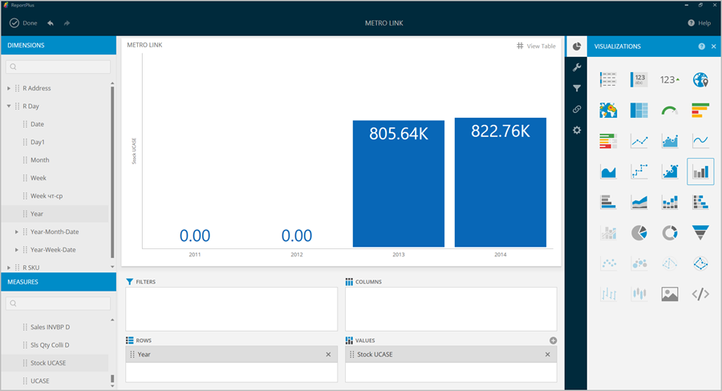
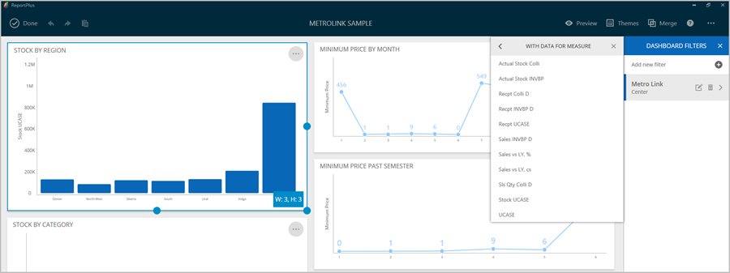

////
|metadata|
{
    "fileName": "working-with-data-sources",
    "controlName": [],
    "tags": []
}
|metadata|
////

= Advanced Data Sources Configuration

There are some data sources which require further configuration, and others that have additional actions available for you to change how information is displayed.

* link:#WorkingWithExcelandGoogleSheets[Excel and Google Sheets], which have extra parameters for labels and automatic range selection.

* link:#WorkingwithCSVs[CSV files], for which date formats can be auto-detected by ReportPlus or identified depending on a specific date format.

* link:#WorkingWithFacebook[Facebook], with mandatory parameters which must be configured for the information to be displayed.

* link:#WorkingWithGoogleAnalytics[Google Analytics], with mandatory parameters which must be configured for the information to be displayed.

* link:#WorkingWithMicrosoftAnalysisServices[Microsoft Analysis Services], with mandatory parameters which must be configured for the information to be displayed. In addition, you have extra options for dashboard filters and sorting.

* link:#WorkingWithMicrosoftReportingServices[Microsoft Reporting Services], for which a specific render mode must be set.

* link:#WorkingWithTwitter[Twitter], with mandatory parameters which must be configured for the information to be displayed.

[#WorkingWithExcelandGoogleSheets]
== Excel and Google Sheets

When you create a dashboard with Excel as a data source, you can enter *parameters* to change how the information is displayed. You will find the fields in the Parameter Settings tab.

image::images/WorkingwithDataSources/ExcelAdvancedParameters_Desktop.png[ExcelAdvancedParameters_Desktop]

The available parameters are:

* *First row contains labels*. If unselected, the application will ignore the values in the first row.
* *Automatic range selection*. If unselected, you can manually select a custom cells range. This can be achieved by manually entering a range in the custom cell range field.

[#WorkingwithCSVs]
== CSV files

*Dates in CSV files are auto-detected and assigned with the corresponding type (Date, DateTime, and Time)*. On rare occasions, however, a date format might not be recognized as expected (e.g.: "dd/mm" identified as "mm/dd"). In those cases, a CSV parameter (DateFormat) can be used to set a specific date format only for the current file. 

Make sure you carefully consider the new date format to be used, as it will replace ReportPlus' auto-detection entirely, identifying as dates only the fields that are an exact match for the _DateFormat_ parameter.

image::images/WorkingwithDataSources/CSVAdvancedParameters_Desktop.png[CSVAdvancedParameters_Desktop]

[#WorkingWithFacebook]
== Facebook

When you create a dashboard with information from Facebook, you need to enter *parameters* for the information to be displayed. You will find the fields in the Parameter Settings tab.

image::images/WorkingwithDataSources/Workingw_Facebook_Desktop.png[Workingw_Facebook_Desktop]

The only two mandatory parameters are the _account_ and _metric_period_ ones. However, it is strongly advisable to choose a date range (_since_ and _until_) to get more accurate results.

Facebook only consumes the Insights API; for more information, check link:https://developers.facebook.com/docs/graph-api/reference/v2.6/insights[this link].

[#WorkingWithGoogleAnalytics]
== Google Analytics

When you create a dashboard with information from Google Analytics, you need to enter *parameters* for the information to be displayed. You will find the fields in the Parameter Settings tab.

The mandatory parameters are _ids_, _start-date_ and _end-date_. While dimensions and segments are optional parameters, it is advisable to fill them in to get more accurate results.

Google Analytics link:https://developers.google.com/analytics/devguides/reporting/core/v3/reference#sort[partially] uses the link:https://developers.google.com/analytics/devguides/reporting/core/v3/#intro[Core Reporting API].

[#WorkingWithMicrosoftAnalysisServices]
== Microsoft Analysis Services

=== Widget Editor

When you create a dashbaord with information coming from Microsoft Analysis Services, you will see fields organized differently as seen in the following screenshot:

As you can see, there is no "Fields" heading. In its place, you will see two sections in their own query field:

[circle]
* DIMENSIONS
* FEATURES

For more information on dimensions and features, please visit this link:https://technet.microsoft.com/en-us/library/ms174527(v=sql.110).aspx[Technet article].

There is also a *Sort by Caption* option which defines whether the filter will be applied to the dimension’s labels or to the corresponding values.

=== Dashboard Filters

When configuring a SSAS-based dashboard filter, there are two additional fields for you to configure:

* A field to select *which data will be displayed*.

* A field to *set your filter with data for measure*.

[#WorkingWithMicrosoftReportingServices]
== Microsoft Reporting Services

When you create a dashboard with information from Microsoft Reporting Services, you will see data in a *Data* format by default under the Parameters section.

If the format is set to *Report*, you will not be able to modify the visualization.

[#WorkingWithTwitter]
== Twitter

When you create a dashboard with information from Twitter, you need to enter *Parameters* for the information to be displayed. You will find the fields in the Parameters section of the Widget Editor.

The only mandatory parameter is the _q_ (query) one. However, it is strongly advisable to choose a language and locale to get more accurate results.

As mentioned in the How to Configure Data Sources section, the Twitter search uses only public data. For more information on the supported Twitter Search API, check link:https://dev.twitter.com/rest/public/search[this link].