////
|metadata|
{
    "fileName": "dashboard-creating-process",
    "controlName": [],
    "tags": ["dashboard","sharing","widget","editing"]
}
|metadata|
////

[#creatingmapvisualization]
= Creating a Map Visualization

In this tutorial, you will learn how to create a Map visualization using a sample spreadsheet. 

|===

^|*Standard Map View* ^|*Satellite Map View*

^|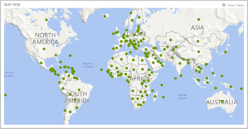 ^|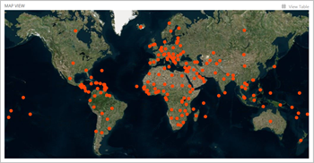

^|*Hybrid Map View* ^|*Standard Map View with Magnitude*

^|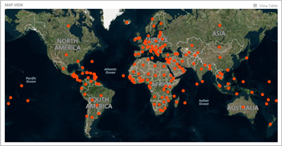 ^|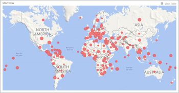

^|*Standard Map View with Conditional Formatting* ^|*Standard Map with Top 10 Filter*

^|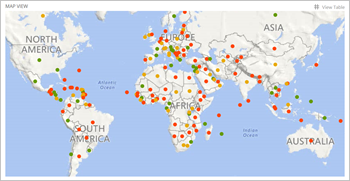

^|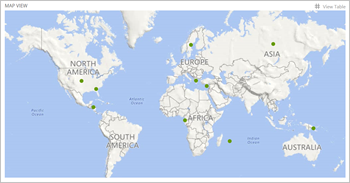

|===

This will also include the magnitude and conditional formatting features for maps.

* link:#createmapvisualizationgeocoding[How to create a Map visualization with Geocoding]
* link:#createmapvisualizationgeocoordinatessinglefield[How to create a Map visualization with Geo-coordinates - Latitude & Longitude in a Single Field]
* link:#createmapvisualizationgeocoordinatesmultiplefields[How to create a Map visualization with Geo-coordinates - Latitude & Longitude in separate Fields]
* link:#changingmaptype[How to change your Map Type]
* link:#addingmagnitudemapvisualization[How to add magnitude to your Map]
* link:#addingconditionalformattingmap[How to add conditional formatting]

---

=== Key Concepts

In order to plot information on the map, this visualization uses one of two Geolocation methods depending on the data source you use:

* *Geocoding*. In this case, ReportPlus expects for at least one of your columns to contain the location for the pin displayed in the map. This is then plotted into a geographical location in the map visualization.

* *Geo-coordinates*. In this case, ReportPlus assumes you have latitude and longitude information (either in one or two columns) within the data set for the map pin location.

For more information on these methods, navigate to the link:http://staging.infragistics.local/help/reportplus/data-visualizations#MapView[Map View] visualization information.

In addition to these terms, you will also need to know about *conditional formatting*. This configuration allows you to establish styling rules per ranges of data up to three ranges (which are usually used for upper, middle and lower ranges). For more information on Conditional Formatting, navigate to the link:http://staging.infragistics.local/help/reportplus/data-visualizations?v=1.0#ConditionalFormatting[Conditional Formatting section].

---

== Sample Data Source

For this tutorial, you will use the "Map View" sheet in the link:ReportPlus-Tutorials-Spreadsheets.xlsx[ReportPlus Tutorials Spreadsheet]. 

* For *Geocoding*, the location information is in column A (_Countries_).
* For *Geo-coordinates*, the location information is in column B, C and D (_Country Latitude_, _Country Longtiude_ and _Latitude and Longitude_).

You can make sure the map view uses either geocoding or geo-coordinates by going to the Visualization Settings pane and setting the "Geolocation Type" to either one.

---

[#createmapvisualizationgeocoding]
== Creating a Map visualization with Geocoding

[cols="^.^1, ^.^1, ^.^1, ^.^4a"]
|===

| |1. *Create a Dashboard* |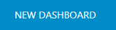 |In the dashboard viewer, click the blue "New Dashboard" button in the top left-hand corner. 

|image:random/Size-sample.png[]
|2. *Select your Data Source*
|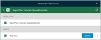
|Click "Browse Files" and select the ReportPlus Tutorials Spreadsheet. Make sure you select the "Map View" sheet.

|image:random/Size-sample.png[]
|3. *Select your Visualization*
|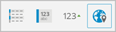
|By default, the visualization type will be set to "Grid". Expand the Visualizations pane and select the Map visualization.

|image:random/Size-sample.png[]
|4. *Organize your data*
|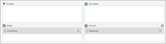
|The location information for Geocoding is in the Countries field. Drag and drop this field in "Rows". Depending on the value you want to display, drag and drop one of the remaining fields into "Values".

|===

Because our excel sheet has both Geocoding and Geo-coordinates information in it, you will to tell ReportPlus which Geolocation method to use. Go to the Visualization Settings pane, and define the following parameters:

* *Geolocation Type*: Geocoding
* *Geocoding Column*: Countries
* *Label*: Countries (the label for the pin in the map)
* *Value*: the field you dropped into "Values"

{nbsp}

[.lead]
link:#creatingmapvisualization[Back to Top]

---

[#createmapvisualizationgeocoordinatessinglefield]
== Creating a Map visualization with Geo-coordinates - Latitude & Longitude in a Single Field

[cols="^.^1, ^.^1, ^.^1, ^.^4a"]
|===

| |1. *Create a Dashboard* | |In the dashboard viewer, click the blue "New Dashboard" button in the top left-hand corner. 

|image:random/Size-sample.png[]
|2. *Select your Data Source*
|
|Click "Browse Files" and select the ReportPlus Tutorials Spreadsheet. Make sure you select the "Map View" sheet.

|image:random/Size-sample.png[]
|3. *Select your Visualization*
|
|By default, the visualization type will be set to "Grid". Expand the Visualizations pane and select the Map visualization.

|image:random/Size-sample.png[]
|4. *Organize your data*
|
|The location for geo-coordinates with latitude and longitude in a single field is in the fourth column. Drag and drop the "Latitude and Longitude" field into Rows. Depending on the value you want to display, drag and drop one of the remaining fields into "Values".

|===

Because our excel sheet has both Geocoding and Geo-coordinates information in it, you will to tell ReportPlus which Geolocation method to use. Go to the Visualization Settings pane, and define the following parameters:

* *Geolocation Type*: Latitude, Longitude Single Field
* *Latitude, Longitude Single Field*: Latitude and Longitude
* *Label*: Countries (the label for the pin in the map)
* *Value*: the field you dropped into "Values".

{nbsp}

[.lead]
link:#creatingmapvisualization[Back to Top]

---

[#createmapvisualizationgeocoordinatesmultiplefields]
== Creating a Map visualization with Geo-coordinates - Latitude & Longitude in separate Fields

[cols="^.^1, ^.^1, ^.^1, ^.^4a"]
|===

| |1. *Create a Dashboard* | |In the dashboard viewer, click the blue "New Dashboard" button in the top left-hand corner. 

|image:random/Size-sample.png[]
|2. *Select your Data Source*
|
|Click "Browse Files" and select the ReportPlus Tutorials Spreadsheet. Make sure you select the "Map View" sheet.

|image:random/Size-sample.png[]
|3. *Select your Visualization*
|
|By default, the visualization type will be set to "Grid". Expand the Visualizations pane and select the Map visualization.

|image:random/Size-sample.png[]
|4. *Organize your data*
|
|The location for geo-coordinates with latitude and longitude in separate fields is in the second and third columns. Drag and drop the "Country Latitude" and "Country Longitude" fields into "Rows". Depending on the value you want to display, drag and drop one of the remaining fields into "Values".

|===

Because our excel sheet has both Geocoding and Geo-coordinates information in it, you will to tell ReportPlus which Geolocation method to use. Go to the Visualization Settings pane, and define the following parameters:

* *Geolocation Type*: Latitude & Longitude Fields.
* *Latitude Column*: Country Latitude.
* *Longitude Column*: Country Longitude.
* *Label*: Countries (the label for the pin in the map).
* *Value*: the field you dropped into "Values".

{nbsp}

[.lead]
link:#creatingmapvisualization[Back to Top]

---

[#changingmaptype]
== Changing your Map Type

ReportPlus offers three flavours for your maps: standard (default), satellite and hybrid maps. To change your layout:

[cols="^.^1, ^.^1, ^.^1, ^.^4a"]
|===

// |||| 

| 
|1. *Change Settings* 
|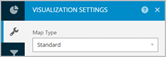 
|Go to the Visualization Settings section.

|image:random/Size-sample.png[]
|2. *Access the Map Type Dropdown*
|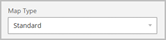
|Expand the "Map Type" dropdown.

|image:random/Size-sample.png[]
|3. *Choose a Map Type*
|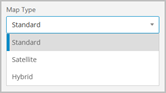
|Select the link:#creatingmapvisualization[map layout] apply.

|===

[.lead]
link:#creatingmapvisualization[Back to Top]

---

[#addingmagnitudemapvisualization]
== Adding Magnitude references to your map

To better visualize the results of adding a magnitude to the map visualization, let's introduce a filter on the "Revenue" value so that it shows the Top 10 results.

[cols="^.^1, ^.^1, ^.^1, ^.^4a"]
|===

// |||| 

| |1. *Filter by Top 10* | |Click the field in "Values" and slide the "Filter by Rule" indicator. By default, the selected filter is "Top Items", and the amount "10".

|image:random/Size-sample.png[]
|2. *Select a Value Color*
|
|When you select a "Value" in the Map View Visualization Settings, a new field, "Value Color" is displayed. Select one of the colors in the list.

|===

You will then see colored circles where you had pins before. The sizes for the circles are determined by the "magnitude" of the data values. In this case, for example, the circles for Greece, Cyprus and Georgia are bigger than the Sweden and Honduras ones because the values are larger.

{nbsp}

[.lead]
link:#creatingmapvisualization[Back to Top]

---

[#addingconditionalformattingmap]
== Adding Conditional Formatting

To turn on conditional formatting for your visualization, turn on Conditional Formatting for the field you dropped in "Values". To do this:

[cols="^.^1, ^.^1, ^.^1, ^.^4a"]
|===

// |||| 

| |1. *Select the Field* |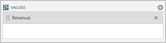 |Click the field in the Pivot Table Values placeholder. 

|image:random/Size-sample.png[]
|2. *Select your Data Source*
|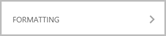
|Expand the Formatting section.

|image:random/Size-sample.png[]
|3. *Apply Conditional Formatting*
|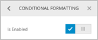
|Slide the "Conditional Formatting" indicator to enable the feature. Configure the conditional formatting's bounds and band as applicable.

|===

{nbsp}

[.lead]
link:#creatingmapvisualization[Back to Top]