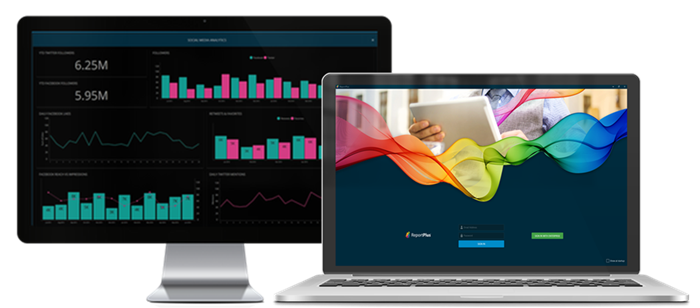
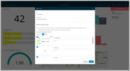
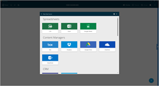
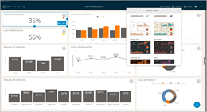
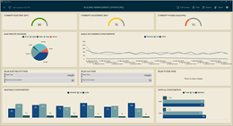
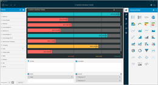
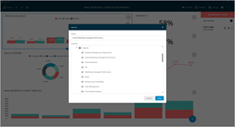

////
|metadata|
{
    "fileName": "home-page",
    "controlName": [],
    "tags": ["desktop","help","home page"]
}
|metadata|
////

= Welcome to the ReportPlus Desktop help!

{nbsp} +

ReportPlus brings its powerful creation and viewing experience to Windows. Easily create dashboards and reports with an intuitive drag and drop interface.

{nbsp} +

==== ReportPlus Desktop's features include:

[cols="20%,40%"]
|===

||link:dashboard-creating-process[*Create new dashboards*]: ReportPlus is a self-service BI tool that enables anyone to do dashboard reporting. You can also quickly and easily create, edit and share your reports.

| |link:how-to-configure-data-sources[*Connect to different data sources*]: Connect to popular Enterprise data sources without setting anything up on the server. Access 20 different data sources, including link:how-to-configure-data-sources#ExcelCSVGoogleSheets[Excel and Google Sheets], link:how-to-configure-data-sources#MicrosoftSQLServer[SQL Server], link:how-to-configure-data-sources#Oracle[Oracle], link:how-to-configure-data-sources#MySQL[MySQL], link:how-to-configure-data-sources#GoogleAnalytics[Google Analytics] and more.

| |link:dashboard-styling[*Style your dashboards*]: Dashboards are more than the sum of their parts. Style them with one of the more than 20 themes available.

| |link:data-visualizations[*Design dashboards*]: Choose among 26 different data visualization options to visualize your data. Choose from link:data-visualizations#ChartsVisualizations[multiple chart types], link:data-visualizations#MapView[map view], link:data-visualizations#GaugeViews[gauge view] and more. You can even use your own link:diy-visualization[HTML-based visualization].

| |link:data-filters[*Customize widgets & dashboards*]: link:data-filters#SortingSettings[Sort], link:data-filters#FieldSpecificFilters[filter], and link:data-filters#PivotTableSettings[summarize] your information. Turn data into information. link:data-filters#FieldSettings[Take it to the level of granularity you need] to better fit your analysis scenarios.

| |*link:getting-started[Access], link:dashboard-creating-process#_sharing_insights[Share] and link:export-options[Export]*: Access your dashboards anywhere; even when you are offline, your dahsboards will by synched across all your devices (including iOS and Android). You can also share your insights with other ReportPlus users for better collaboration or export dashboards as PDF, PowerPoint slides, or images. Make it easier for everyone in the team to tailor your dashboards and help improve the decision making for everyone.

|===